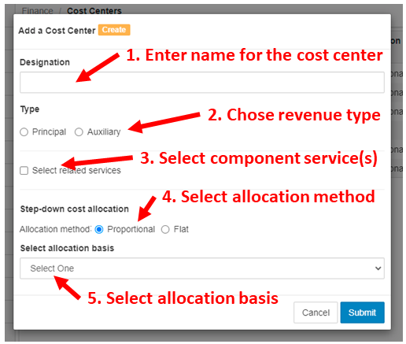
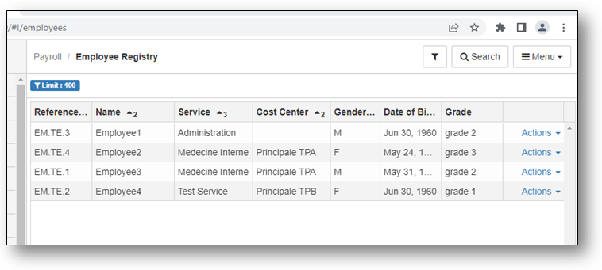

# Step-Down Cost Allocation Analysis with BHIMA

There are several steps necessary to set and perform *step-down* cost
allocation with BHIMA:

1. [Choose the cost centers](#chose-cost-centers)
2. [Set up allocation bases for each Cost Center](#define-cost-center-allocation-bases)
3. [Set up cost centers](#set-up-cost-centers)
4. [Perform *step-down* cost allocations](#perform-step-down-cost-allocations)

## Chose Cost Centers

Before explaining **Cost Centers**, it is useful to understand the term
**Service** in BHIMA.  *Services* are often called *departments* in typical
hospitals.  A *service* is usally focused on a specific function within the
hospital.  When patients are admitted, they are initally assigned to a
specific *service*.  Over the course of their visit, patients may interact
with multiple services.  Employees are assigned to one *Service* and are
usually managed by someone in that *Service*.  In BHIMA, a *Service* or
*Department* and is often called a *Cost Center*.  However, more than one
Service can be assigned to a single cost center.  Usually, if multiple
services are closely related they can be considered as one *Cost Center*.

The first step is to chose cost centers is to consider the nature of the
departments (services) in the hospital being analyzed.  Which are the main
departments?  Are there separate departments that should be considered
together (as one *Cost Center*)?  Is the department offering services or goods
and receiving revenue from outside sources -- or is the department primarily
serving other departments in the hospital?  It is possible there are no
clear-cut answers to these questions but for this analysis, it is necessary to
classify each department by whether it is **primarily** a *revenue* department
(called **principal** in BHIMA) or not (called **auxilliary** in BHIMA).
Perhaps a department primarily serves other departments but occasionally
receives payments for some service.  In this case it would probably make sense
to consider this a non-revenue department.  In BHIMA, a *Cost Center* can
either be a *revenue* or *non-revenue* department/service (or combination).

In some cases, deciding whether a deparment is a *revenue* department or not
might be difficult.  The BHIMA software makes it straight-forward to
experiment and try the cost allocation analysis with either choice.

A key end goal in these considerations to produce the total direct and
indirect costs for each revenue department to understand whether the revenue
departments are making enough revenue to cover their total costs (including
direct costs as well as indirect costs from other departments).  Then the
financial managers can make any adjustments necessary to ensure the long-term
financial viability of the hospital.

The end result of this step should be a list of *Cost Centers* (departments or
services) classified by whether they are primarily revenue cost centers (or or
not).  The list should also indicate with Services will be considered together
as a singe *Cost Center*.  The list should also include the name of the person
who manages the department or who has understanding of how it operates.  It may
be necessary to consult with them to obtain the data necessary to construct
the allocation bases (in the next section).

## Define Cost Center Allocation Bases

Chosing an *allocation basis* for each non-revenue department is the next
step.  BHIMA defines several typical allocation bases which can be used as
needed.  It is also possible to define new allocation bases, if needed.  Here
are the *allocation bases* predefined in BHIMA along with some examples of the
services (departments) that might use them.

| Name      | Description              | Units         | Could be used by |
|-----------|--------------------------|---------------|---------|
| Area used | Area used by the service | m2 | Housekeeping, Maintenance | 
| Direct cost | Direct cost of the service |  | Administration |
| Electricity consumed | Electricity consumed by the service | kWh | Electrical |
| Num. computers | Number of computers in the service | | Information Technology |
| Num. employees | Number of employees of the service | | Administration, Human Resources |
| Num. lab tests | Num. of laboratory tests performed for the service | | Laboratory |
| Num. labor hours | Number of labor hours by the service | hours | Administration, Human Resources |
| Num. patients | Num. patients cared for by the service | | Surgery, Wards |

In some cases, it may be necessary to define a new *allocation basis*.  For
instance, if there is more than one Laboratory in the hospital (e.g. Pathology
and Radiology).  Then it might make sense to create a new basis tailored to
this need: Number of X-rays.  It is important to select an *allocation basis*
for each servce department that represents the main cost driver for the
department so that allocating its direct costs to other departments is done in
a reasonable way.  For instance, for Radiology, the costs are mainly driven by
the cost for performing each X-ray (in terms of labor and other costs for
performing each X-ray).  So using the number of X-Rays performed by Radiology
for each department probably makes more sense than other measures (such as
department area).

It is also necessary to determine the values of each allocation basis for each
department.  For instance, if a service department (e.g., Housekeeping) uses
*area* for its allocation basis it will be necessary to determine the area of
each department.  In some cases, once BHIMA is set up properly, it can
determine the values of some of these *allocation bases* (eg, Number of
employees).  In many cases, particularly with *allocation bases* that are
defined by the user, they will have to be entered manually.

The result of this step should be a list of *non-revenue* departments (cost
centers) along with the allocation basis selected for each department.

The following section will show how to construct the cost centers and
allocation bases in BHIMA.

## Set Up Cost Centers

Setting up cost centers in BHIMA includes the following phases:

 1. [Creating the Cost Centers](#create-cost-centers) - Create cost centers
    (from the list constructed in the previous step). This includes assigning
    all active services to specific cost centers.

 2. [Verify Employee Coverage](#verify-employee-coverage) 
    Make sure that that all employees are associated with a cost center.
 
 3. [Verify Account Coverage](#verify-account-coverage)
    Make sure that all accounts are tracked by a cost center.
 
### Create Cost Centers

Open the BHIMA `Cost Centers` registry page.

  

  <i>menu</i> > Cost Center Management > <strong>Cost Centers</strong>  
   &rArr; Opens the Cost Centers registry page
  

Then click on the \[+Add\] button on the top right of the page.  A form to
create a cost center will come up and look like this:

Fill out the form in the following steps:

 1. Enter a name for the cost center
 2. Choose the main revenue type for the cost center:
    - *Principal* => This cost center is a revenue (principal) cost center
	- *Auxilliary* => This cost center is a non-revenue (auxilliary) cost center
	  	  
	If **Principal** is selected, several new options will appear:

	- Assigned profit references
	- Assigned cost references

	These options enable chosing **account references** which determine which
	accounts provide profits or costs to this cost center.  How to create and
	use the *account references* will be explained later.

	If **Auxilliary** is selected, the new options that appear are:

	- Cost Center
	- Profit Center

	As before, these options enable chosing **account references** for **variable**
	or **fixed** costs (for Cost Centers), or **turnover** or **other profits**
	(for profit centers).  Using these options will be explained in more detail
	later. 

 3. Chose services assigned to this cost center.  Once this option is
    selected, an input field will appear that will allow service(s) to be
    selected that will be part of this Cost Center.

 4. Chose the allocation method.  Normally alloction of indirect costs to cost
    centers will be done proportionally based on the allocation basis
    selected -- so this should be set to **Proporational**.  However in some
    cases, it is not clear how to allocate costs to other centers.  In that
    case, selecting **Flat** will divide the costs evenly to the other cost
    centers. 

 5. Select the allocation basis for this center.  An allocation basis must be
    selected, even for principal cost centers.

Once the form is filled out, press the \[Submit\] button to create the cost
center.  This will show the list of cost centers including the newly created
cost center.

Repeat this process until all all necessary cost centers are created.  The
cost center registry shows the services associated with each cost centers so
it easy to see any cost centers which do not have service centers.
Every cost center should have at least service assigned to it.

Also, for Cost Center analysis, it is necessary to have every employee
assigned to a service.

### Verify Employee Coverage
In Cost Center financial analysis it is necessary to make sure all employees
are assigned to a cost center.  This can be done via the employee registry
page. 

  

  <i>menu</i> > Human Resources > <strong>Employee Registry</strong>  
   &rArr; Opens the Employee Registry page
  

 
By default this page does not show the Cost Centers for each employee.  To
enable that, 
  - click on the \[Menu\] button the top right of the page,
  - select the **Columns** option,
  - Enable **Service** and **Cost Center** options, and
  - click \[Submit\].
To make sure that the **Service** and **Cost Center** columns remain
displayed, click on the \[Menu\] > **Save Grid Configuration** option.
The employee registry looks like this:

  
In this example, we can see that *Employee1* is not assigned to any cost
center.  Since *Employee1* is assigned to the *Administration* service,
apparently the *Administration* service is not assigned to any cost center.
Therefore the appropriate cost center needs to be edited to add the
*Administration* service to it.

Note that the custom search filters (available through the \[Search\] button
on the top right of the page) allows filtering the list by cost center or
employees how are not in any cost center.  In installations with many
employees, this will make it easier to identify employees who are not assigned
to any cost center and take corrective actions.

This display also make it easy to see if there are any employees who have not
been assigned to any service.

Update Cost Centers and Services until all employees are included in a Cost
Center.

### Verify Account Coverage

## Perform Step-Down Cost Allocations
