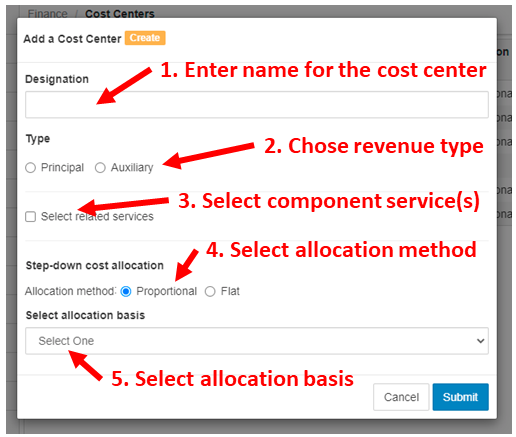
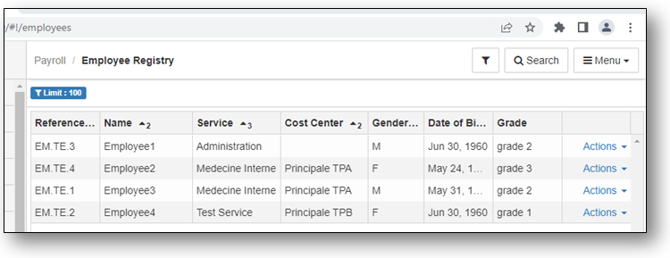
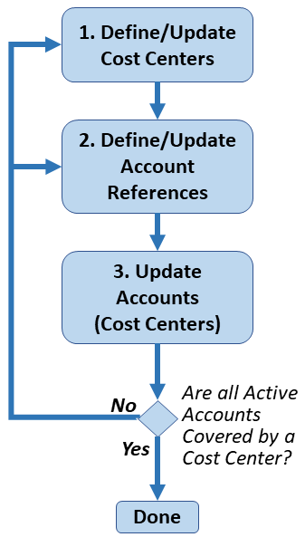
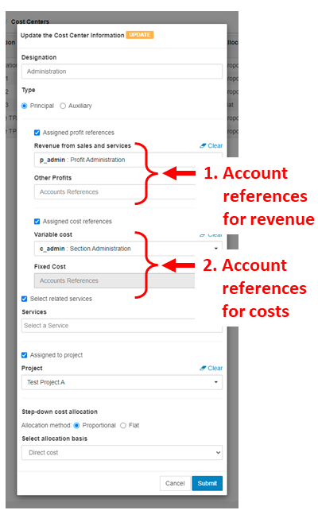
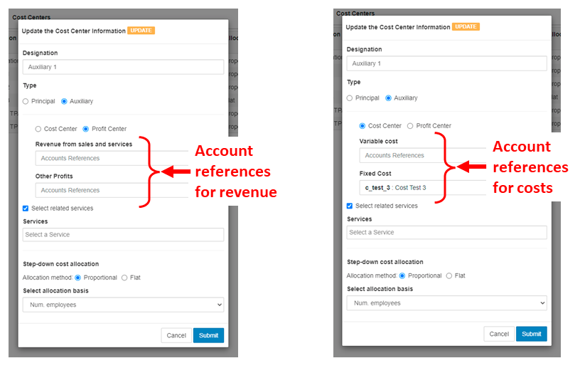
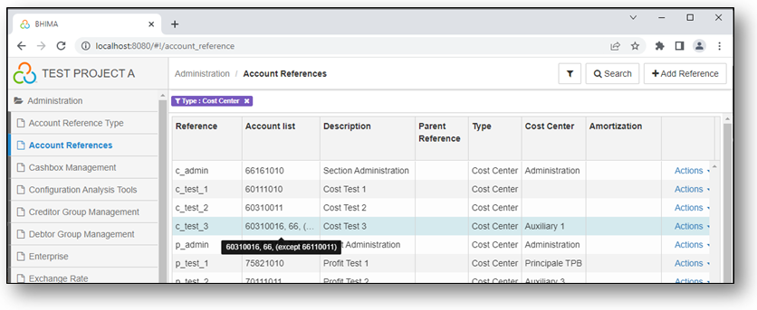
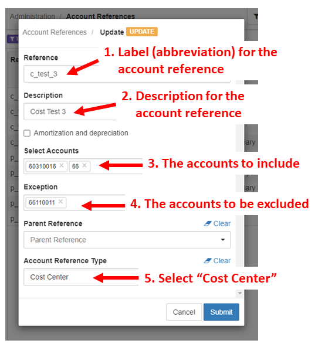
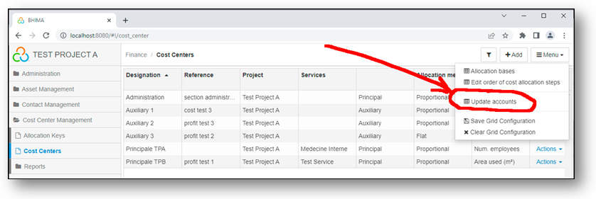

# Step-Down Cost Allocation Analysis with BHIMA

There are several steps necessary to set and perform *step-down* cost
allocation with BHIMA:

1. [Choose the cost centers](#chose-cost-centers)
2. [Set up allocation bases for each Cost Center](#define-cost-center-allocation-bases)
3. [Set up cost centers](#set-up-cost-centers)
4. [Perform *step-down* cost allocations](#perform-step-down-cost-allocations)

## Chose Cost Centers

Before explaining **Cost Centers**, it is useful to understand the term
**Service** in BHIMA.  *Services* are often called *departments* in typical
hospitals.  A *service* is usually focused on a specific function within the
hospital.  When patients are admitted, they are initially assigned to a
specific *service*.  Over the course of their visit, patients may interact
with multiple services.  Employees are assigned to one *Service* and are
usually managed by someone in that *Service*.  In BHIMA, a *Service* or
*Department* and is often called a *Cost Center*.  However, more than one
Service can be assigned to a single cost center.  Usually, if multiple
services are closely related they can be considered as one *Cost Center*.

The first step is to chose cost centers is to consider the nature of the
departments (services) in the hospital being analyzed.  Which are the main
departments?  Are there separate departments that should be considered
together (as one *Cost Center*)?  Is the department offering services or goods
and receiving revenue from outside sources -- or is the department primarily
serving other departments in the hospital?  It is possible there are no
clear-cut answers to these questions but for this analysis, it is necessary to
classify each department by whether it is **primarily** a *revenue* department
(called **principal** in BHIMA) or not (called **auxiliary** in BHIMA).
Perhaps a department primarily serves other departments but occasionally
receives payments for some service.  In this case it would probably make sense
to consider this a non-revenue department.  In BHIMA, a *Cost Center* can
either be a *revenue* or *non-revenue* department/service (or combination).

In some cases, deciding whether a department is a *revenue* department or not
might be difficult.  The BHIMA software makes it straight-forward to
experiment and try the cost allocation analysis with either choice.

A key end goal in these considerations to produce the total direct and
indirect costs for each revenue department to understand whether the revenue
departments are making enough revenue to cover their total costs (including
direct costs as well as indirect costs from other departments).  Then the
financial managers can make any adjustments necessary to ensure the long-term
financial viability of the hospital.

The end result of this step should be a list of *Cost Centers* (departments or
services) classified by whether they are primarily revenue cost centers (or or
not).  The list should also indicate with Services will be considered together
as a singe *Cost Center*.  The list should also include the name of the person
who manages the department or who has understanding of how it operates.  It may
be necessary to consult with them to obtain the data necessary to construct
the allocation bases (in the next section).

## Define Cost Center Allocation Bases

Choosing an *allocation basis* for each non-revenue department is the next
step.  BHIMA defines several typical allocation bases which can be used as
needed.  It is also possible to define new allocation bases, if needed.  Here
are the *allocation bases* predefined in BHIMA along with some examples of the
services (departments) that might use them.

| Name      | Description              | Units         | Could be used by |
|-----------|--------------------------|---------------|---------|
| Area used | Area used by the service | m2 | Housekeeping, Maintenance | 
| Direct cost | Direct cost of the service |  | Administration |
| Electricity consumed | Electricity consumed by the service | kWh | Electrical |
| Num. computers | Number of computers in the service | | Information Technology |
| Num. employees | Number of employees of the service | | Administration, Human Resources |
| Num. lab tests | Num. of laboratory tests performed for the service | | Laboratory |
| Num. labor hours | Number of labor hours by the service | hours | Administration, Human Resources |
| Num. patients | Num. patients cared for by the service | | Surgery, Wards |

In some cases, it may be necessary to define a new *allocation basis*.  For
instance, if there is more than one Laboratory in the hospital (e.g. Pathology
and Radiology).  Then it might make sense to create a new basis tailored to
this need: Number of X-rays.  It is important to select an *allocation basis*
for each service department that represents the main cost driver for the
department so that allocating its direct costs to other departments is done in
a reasonable way.  For instance, for Radiology, the costs are mainly driven by
the cost for performing each X-ray (in terms of labor and other costs for
performing each X-ray).  So using the number of X-Rays performed by Radiology
for each department probably makes more sense than other measures (such as
department area).

It is also necessary to determine the values of each allocation basis for each
department.  For instance, if a service department (e.g., Housekeeping) uses
*area* for its allocation basis it will be necessary to determine the area of
each department.  In some cases, once BHIMA is set up properly, it can
determine the values of some of these *allocation bases* (eg, Number of
employees).  In many cases, particularly with *allocation bases* that are
defined by the user, they will have to be entered manually.

The result of this step should be a list of *non-revenue* departments (cost
centers) along with the allocation basis selected for each department.

The following section will show how to construct the cost centers and
allocation bases in BHIMA.

## Set Up Cost Centers

Setting up cost centers in BHIMA includes the following phases:

 1. [Creating the Cost Centers](#create-cost-centers) - Create cost centers
    (from the list constructed in the previous step). This includes assigning
    all active services to specific cost centers.

 2. [Verify Employee Coverage](#verify-employee-coverage) 
    Make sure that that all employees are associated with a cost center.
 
 3. [Verify Account Coverage](#verify-account-coverage)
    Make sure that all accounts are tracked by a cost center.
 
### Create Cost Centers

Open the BHIMA `Cost Centers` registry page.

  

  <i>menu</i> > Cost Center Management > <strong>Cost Centers</strong>  
   &rArr; Opens the Cost Centers registry page
  

Then click on the \[+Add\] button on the top right of the page.  A form to
create a cost center will come up and look like this:

Fill out the form in the following steps:

 1. Enter a name for the cost center
 2. Choose the main revenue type for the cost center:
    - *Principal* => This cost center is a revenue (principal) cost center
	- *Auxiliary* => This cost center is a non-revenue (auxiliary) cost center
	  	  
	If **Principal** is selected, several new options will appear:

	- Assigned profit references
	- Assigned cost references

	These options enable choosing **account references**
	which determine which accounts provide profits or costs to this cost
	center.  How to create and use the **account references** will be explained
    in a [later section](#account-references).

	If **Auxiliary** is selected, the new options that appear are:

	- Cost Center
	- Profit Center

	As before, these options enable choosing **account references** for **variable**
	or **fixed** costs (for Cost Centers), or **turnover** or **other profits**
	(for profit centers).  Using these options will be explained in more detail
	later. 

 3. Chose services assigned to this cost center.  Once this option is
    selected, an input field will appear that will allow service(s) to be
    selected that will be part of this Cost Center.

 4. Chose the allocation method.  Normally allocation of indirect costs to cost
    centers will be done proportionally based on the allocation basis
    selected -- so this should be set to **Proportional**.  However in some
    cases, it is not clear how to allocate costs to other centers.  In that
    case, selecting **Flat** will divide the costs evenly to the other cost
    centers. 

 5. Select the allocation basis for this center.  An allocation basis must be
    selected, even for principal cost centers.

Once the form is filled out, press the \[Submit\] button to create the cost
center.  This will show the list of cost centers including the newly created
cost center.

Repeat this process until all all necessary cost centers are created.  The
cost center registry shows the services associated with each cost centers so
it easy to see any cost centers which do not have service centers.
Every cost center should have at least service assigned to it.

Also, for Cost Center analysis, it is necessary to have every employee
assigned to a service.

### Verify Employee Coverage
In Cost Center financial analysis it is necessary to make sure all employees
are assigned to a cost center.  This can be done via the employee registry
page. 

  

  <i>menu</i> > Human Resources > <strong>Employee Registry</strong>  
   &rArr; Opens the Employee Registry page
  

 
By default this page does not show the Cost Centers for each employee.  To
enable that, 
  - click on the \[Menu\] button the top right of the page,
  - select the **Columns** option,
  - Enable **Service** and **Cost Center** options, and
  - click \[Submit\].
To make sure that the **Service** and **Cost Center** columns remain
displayed, click on the \[Menu\] > **Save Grid Configuration** option.
The employee registry looks like this:

  
In this example, we can see that *Employee1* is not assigned to any cost
center.  Since *Employee1* is assigned to the *Administration* service,
apparently the *Administration* service is not assigned to any cost center.
Therefore the appropriate cost center needs to be edited to add the
*Administration* service to it.

Note that the custom search filters (available through the \[Search\] button
on the top right of the page) allows filtering the list by cost center or
employees how are not in any cost center.  In installations with many
employees, this will make it easier to identify employees who are not assigned
to any cost center and take corrective actions.

This display also make it easy to see if there are any employees who have not
been assigned to any service.

Update Cost Centers and Services until all employees are included in a Cost
Center.

### Verify Account Coverage

The next step is to make sure that all active accounts are covered by a cost
center.  This involves these steps:

1. [Make sure each cost center defines appropriate **account
   references**](#identify-and-update-account-references-used-by-cost-centers). The
   purpose of **account references** and how they work will be reviewed in the
   [section on **account references**](#account-references).

2. [Review and update the **account references**](#account-references) used by
   the cost centers to make sure that all active accounts are covered by a
   cost center.
   
3. [Update the cost center assigned to each account](#update-cost-centers-in-all-accounts) 
   based on the **account reference** the cost center uses.
   
Note that working through these steps will probably be an iterative process.
It may be necessary to repeat these steps several times to get all accounts
covered by a cost center appropriately. 
   
#### Identify and Update Account References used by Cost Centers

To review and update the **account references** used each cost center, visit
the Cost Centers registry page:

  

  <i>menu</i> > Cost Center Management > <strong>Cost Centers</strong>  
   &rArr; Opens the Cost Centers registry page
  

----------------------------------------------------------------------

Pick a cost center and use its **Action** menu to edit it.  For a
**principal** cost center, you might see something like the display to the right.
**Principal** here means that it is a *principal* revenue center and derives a
significant amount of income due to sales of goods or services for the
organization.  Normally "overhead" services or departments are **auxiliary**
cost centers, not **principal** ones.

(1) Review the account references selected for "Revenue from sales and
services" and "Other profits" and update them if necessary.  Note that only
one account reference can be chosen for each.  That is not a limitation since
account references can cover many accounts (as will be shown in the next
section).

(2) Also review and update the account references for the costs for this cost
center.  Note that for step-down cost allocation analysis, using separate
account references for variable and fixed costs is not critical.  However
other cost center analysis such as break-even analysis will need separate
account references for variable and fixed costs, so it is good to do it now.  It
is possible that the accounts may need to restructured to accomplish that.

When selecting an **account reference** in the revenue section or the costs
section, clicking on the box for the **account reference** will display a
pop-up dialog that will allow selection of the correct **account reference**.

It is also good to review and update the **Services** covered by this cost
center.

----------------------------------------------------------------------

The display when editing an **auxiliary** cost center has different options
for the account references.  There are two types of **auxiliary** cost
centers:

 - Cost Center (costs only, no revenue)
 - Profit Center (revenue only, no costs)

Here is what editing these two types of **auxiliary** costs centers might
look like:

For a **profit center** (left), review the account references used for the
"Revenue from sales and services" and "Other profits" and update them as
necessary.  For an **auxiliary** **cost center** (right), review the account
references used for the "Variable cost" and "Fixed Cost" and update them as
necessary.

It may be necessary to add new **auxiliary** cost centers and restructure
accounts and to cleanly separate the **auxiliary** cost and profit centers.

Again, it is also good to review and update the **Services** covered by this
cost center.

#### Account References

**Account References** define sets of accounts that are used in several ways
in BHIMA, including Cost Centers.  **Account References** are a very flexible
way to define a set of accounts be defining accounts to be included and
accounts that will be excluded.  In BHIMA, accounts are structured in a
hierarchical way.  So if an account with child accounts is used in an account
reference, all the child accounts for that parent account will be included --
unless any accounts are excluded.  To see and edit **account references**,
visit the **Account References** page:

  

  <i>menu</i> > Administration > <strong>Account References</strong>  
   &rArr; Opens the Account References registry page
  

The display of the **Account References** registry looks something like
this. Note that this display has been filtered to only show **Account
References** for cost centers.

The columns are:

- **Reference** - The short label (or abbreviation) for the **Account
  Reference**.  These labels must be unique.
- **Account List** - The list of accounts covered by this **Account
  Reference**.  Note that the list may be truncated.  But hovering the mouse
  pointer over the **Account List** column for an **Account Reference** will
  show the full list of accounts (as shown here in black).
- **Description** - The description of the **Account Reference**
- **Parent Reference** - Not needed for Cost Centers
- **Type** - The type of the **Account Reference** (limited to "Cost Centers"
  in this display).
- **Cost Center** - The cost center that uses this **Account Reference**.
- **Amortization** - Whether it is an account for amortization /
  depreciation.
- **Action** - A menu of actions that can be applied to the **Account
  Reference**.
  
Referring back to editing **Account References** in the [beginning of this
section](#identify-and-update-account-references-used-by-cost-centers), notice
that the **Account References** are refereed to by combining the label with the
description.  It is helpful to chose the names of the **Account Reference**
labels to clearly indicate which cost centers will use them and their function
(as shown here).

To create a new **Account Reference** click on the \[+ Add Reference\] button
on top right.

Creating or editing an **Account Reference** used the same form.  To create or
edit an **Account Reference** enter or edit the fields of the form as follows:

1. **Reference** - Enter a short label (or abbreviation for the **Account
   Reference**)
2. **Description** - Enter a description for the **Account Reference**
3. **Select Accounts** - Select the accounts to include.  Clicking in the
   field will display a drop-down with all accounts. Multiple accounts
   can be selected.  If **title** accounts are selected (accounts which have
   child accounts) all the child accounts will also be selected.
4. **Exception** - Select any accounts to be excluded from this **Account
   Reference**.
5. **Parent Reference** - Not needed for cost centers
6. **Account Reference Type** - Select "Cost Center"

Note that there is a checkbox for "Amortization and depreciation" which can be
selected, if appropriate.
 
----------------------------------------------------------------------

#### Update Cost Centers in All Accounts

After making sure that all cost centers have appropriate **Account
References** and that the **Account References** are defined correctly, an
additional step is necessary to update the accounts based on the **Account
Reference** defined for each cost center. Open the BHIMA **Cost Centers**
registry page.

  

  <i>menu</i> > Cost Center Management > <strong>Cost Centers</strong>  
   &rArr; Opens the Cost Centers registry page
  

The Cost Centers will be shown. For example:

Click on the **Update Accounts** command in the main menu (as shown in the
figure).  This will update the accounts based on the current Cost Center and
**Account References**.   The update will immediately switch to the Accounts
management page (under the **Finance** menu).  By looking the at the **Cost
Centers** column, it is easy to determine any accounts have been overlooked. 

It is likely that organization financial team will need to be involved in
setting the cost centers and account references to make sure that active
accounts are covered by a cost center.

----------------------------------------------------------------------

## Perform Step-Down Cost Allocations

