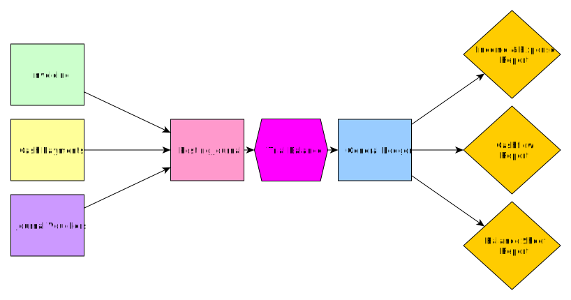

# Overview of Financial Modules

Before delving into the details of each financial module, it is important to keep the overall flow of data in BHIMA in mind.

The above diagram shows the flow of data entry into the system, covering the three basic records in BHIMA: **Cash Payments**, **Patient Invoices**, and **Journal Vouchers**.  Each record is backed by a transaction written to the [Journal](./ledgers/journal-module.md).  Through a validation process called the [Trial Balance](./ledger/trial-balance.md), transactions in the Journal are posted to the [General Ledger](./ledgers/general-ledger.md) after which the transaction is unalterable.

All financial activities recorded with BHIMA are represented by two entities:

1. The original Record contains all details and meta data about the activity, this could be a Cash Payment, Patient Invoice or Journal Voucher.
2. The actual financial transaction that is written to the Journal and directly links the original Record as the source \(reason for existing\) for this financial transaction.

While the transaction can be modified in the Journal, the original document cannot be modified and preserves a record of the original values as entered into the application.  The only exception to this is deletion.  If a transaction or record is deleted, both the record and data in the Journal are expunged.  Only unposted transactions may be deleted.

<h4>To delete or reverse?</h4>
To correct mistakes, transactions in BHIMA can either be deleted or reversed through a subsequent correction writing.  Deletion is a permanent removal of a transaction and is often used for temporary user mistakes that are immediately corrected. Reversal writes a second transaction that is for the equal and opposite value of the original 'mistaken' transaction - this logically 'reverses' the finances and preserves all history and is often used for processes like an unexpected refund. It is your preference which policy you choose to use, but it is important to have a uniform policy to avoid future headaches trying to audit the books.  Deleting malformed or incorrect transactions results in a cleaner transaction history, but reversals will reflect the real process by which the transactions were derived.

Once a transaction is created in the Journal via a Voucher, Invoice, or Cash Payment, the transaction is reviewed by an accountant and posted \(verified through the Trial Balance process\), after which it will appear in the General Ledger and subsequent reports.

## Double Entry Bookkeeping

At its heart, BHIMA is a double entry accounting software.  In double entry accounting, transactions are composed of two or more lines, each corresponding to a single account.  The value moved in or out of the accounts are recorded as either _debits_ or _credits_.  Debits and credits are opposites, but their behavior isn't always intuitive or well defined.  In general, one can consider debits as positive numbers and credits as negative number.  [This source](https://debitoor.com/dictionary/debit) provides the following definitions \(the first one is wrong online and is corrected below\):

1. To debit a debtor account implies an increase in the debtor's debt.  In contrast, to credit a debtor account implies a reduction in their debt to the enterprise.
2. To debit an asset account implies that the assets increase.  By contrast, to credit an asset account reduces the assets.
3. To debit an income account implies that income decreases.  To credit the income account increases the income.
4. To debit an expense account implies that the cost increases.  To credit an expense account implies that cost decreases.

Debits and credits _must_ balance in a transaction. All things being equal, income accounts will hold a credit balance while expense accounts will hold a debit balance.

<h4>Keeping debits and credits straight</h4>

The concept of debits and credits is learned through experience and even seasoned accountants mix up their roles.  An easy scenario to help sort out confusion is to imagine transactions with a cashbox or bank account.

To put money into the cashbox (an asset account), you <b>debit</b> the cashbox, increasing its value.  Since the transaction must be balanced, the opposite side of the transaction must hold a <b>credit</b> value.  If it is a client paying their debts, they must have begun the transaction with a **debit** value.  Therefore, the invoicing operation must have **debited** the client and credited an income account.

