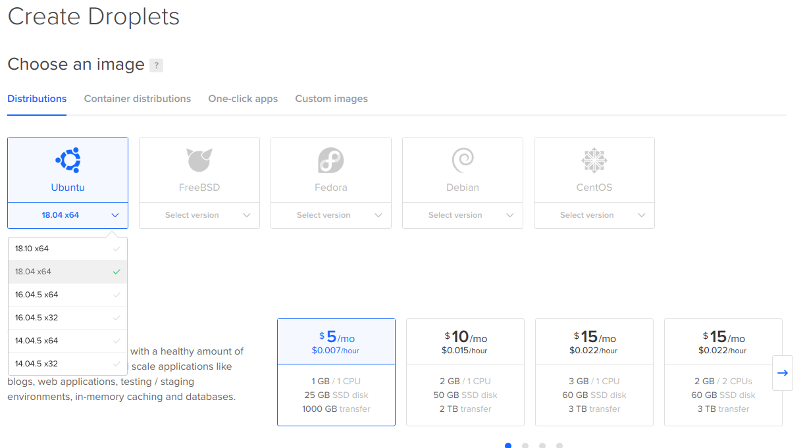

<style>
    .guilabel {
    border: 1px solid #7fbbe3 !important;
    background: #e7f2fa;
    font-size: 80%;
    font-weight: 700;
    border-radius: 4px;
    padding: 2.4px 6px;
    margin: auto 2px;
    color:#001
    }

    .left40 {
      margin-left:40px
    }
</style>


# Installing BHIMA on DigitalOcean

<i> Follow these steps below posted at https://docs.opendatakit.org/aggregate-digital-ocean</i>

## Warning
<p>
To use this setup, you must able to link a domain name to the machine's IP address. If you don’t own a domain, services such as <a href='https://freedns.afraid.org/'>FreeDNS</a> offer free sub-domains under a range of domains.
</p>

### Tip
If you have not already created a DigitalOcean account, use our referral link to do so: https://m.do.co/c/39937689124c.

DigitalOcean will give you $100 of credit to spend during the first 60 days so that you can try things out. Once you have spent $25 with them, we’ll get $25 to put towards our hosting costs.

# Create your Droplet

1. Log into DigitalOcean and create a new Droplet.

2. Select the distribution for your new Droplet: Select the option <span class='guilabel'>18.04.x x64</span> from the Ubuntu box.



3. Select a size fit for your intended usage. The <span class='guilabel'>$5 Standard Droplet</span> should be enough for light Bhima use. If you find yourself needing more, DigitalOcean makes it easy to resize to a bigger Droplet.

4. If you would like automatic weekly backups, enable them.

5. You will not need block storage.

6. Select a datacenter region physically close to where you are.

7. Under <span class='guilabel'>Select additional</span> options, check the <span class='guilabel'>User data</span> checkbox. Copy and paste the contents of this <a href='.../../cloud-init.yml'> Cloud-Config script</a>.


8. In the Choose a hostname section, enter the domain name (e.g., your.domain). This hostname will be used by the Cloud-Config script to configure your server’s HTTPS support.

9. You will not need to add public SSH keys (unless you know what that is and you want to).

10. Click on the Create button. The Droplet takes a few seconds, the actual Bhima installation will take up to 10 minutes to complete.

# Set up your domain
## Tip
<p>
DigitalOcean Droplets use IP addresses which can change if you destroy the machine. To ensure your Bhima install will always be reachable using the same IP address, use a Floating IP by following these instructions.
</p>

1. Once the Droplet is running, take note of its public IP address (e.g., 12.34.56.78) and set a DNS A record pointing to it.
<ul class="left40">
 <li>
   If you own a domain, check your domain registrar's instructions. If you don't own a domain, we recommend using <a href='https://freedns.afraid.org/'>FreeDNS</a>  to get a free sub-domain.
 </li>
 <li>
   Your domain's *TTL* setting will affect to how much time you will have to wait until you can proceed to the next step.
   If your provider gives you the option of setting a *TTL*, use the lowest value you can.
 </li>
</ul>

2. Open a web browser, and periodically check the domain until you see the BHIMA website. You won't be able to continue the install until you see the website load.

# Enable HTTPS
1. From the DigitalOcean Control Panel, click the name of your droplet, then select <span class='guilabel'>Access</span> from the left navigation. Click the <span class='guilabel'>Launch Console</span> button to open a web-based console session.

2. When the console opens, click the console screen, and at the login prompt, enter the user: root. Your password will be the root password that DigitalOcean emailed you.

<ul class="left40">
<li>
If you do not have the root password, click the name of your droplet, select Access from the left navigation and choose Reset the root password so that a password gets emailed to you.
</li>
<li>
 You may also login over SSH using the ssh root@your.domain.
</li>
</ul>

3. Once you are logged in, run ``` sudo certbot run --nginx --non-interactive --agree-tos -m YOUR_EMAIL --redirect -d YOUR_DOMAIN```.

<ul class="left40">
<li>
Be sure to replace YOUR_EMAIL and YOUR_DOMAIN with your email address and your domain.
</li>
<li>
Lets Encrypt uses the email you provide to send notifications about expiration of certificates.
</li>
</ul>

# Launch BHIMA to the browser
1. Go to https://your.domain and check that Bhima is running.

2. You can now start setting your interprise informations up by clicking the button <span class='guilabel'>install</span>
