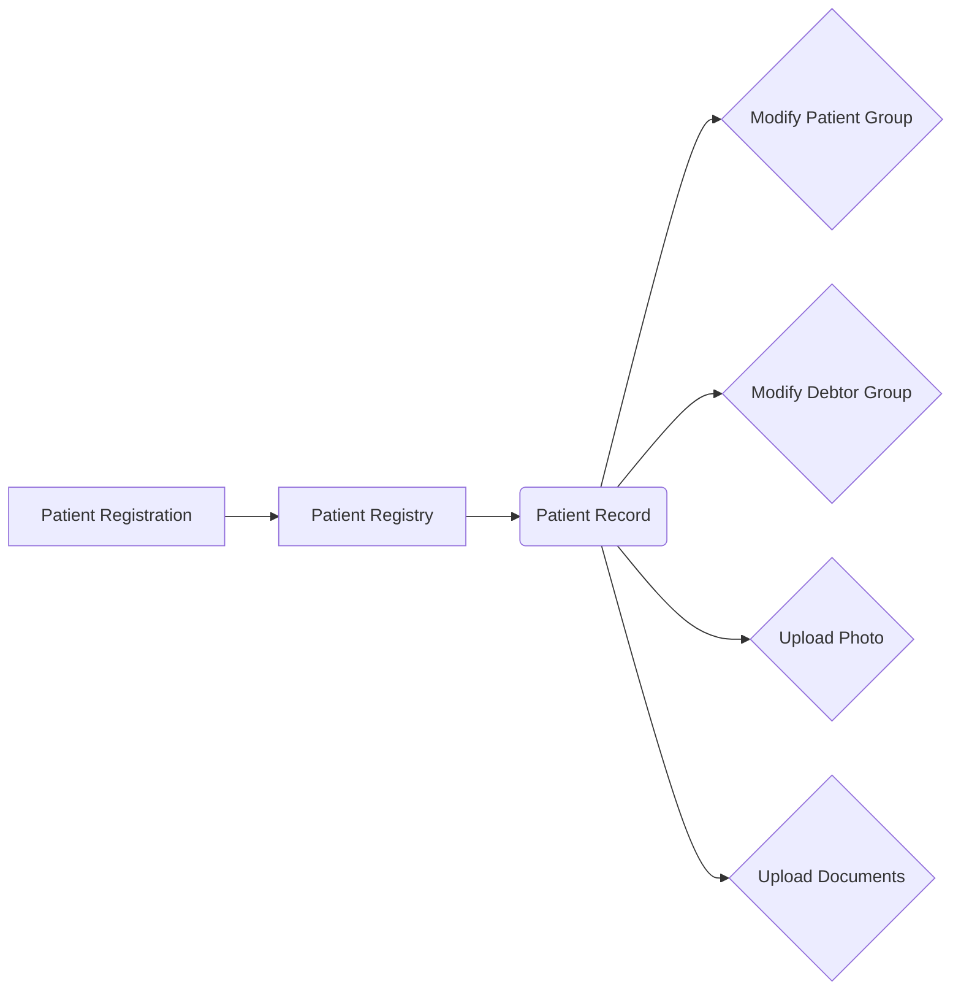
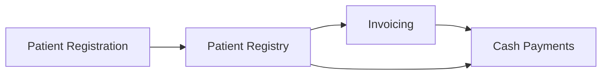

# Patient Management

The vast majority of clients of the hospital are patients.  Since BHIMA is primarily focused on the accounting and managerial aspects of the hospital, the medical records component of BHIMA are underdeveloped.  Instead the primary function of patients is to create a debtor to attach a financial history to.  Despite the emphasis on finance, BHIMA supports a few purely medical features, including demographic and biometric data associated with patients, a tool to attach documents to patients, management of patient groups, and management of patient visits.

<h4>Have a recommendation?</h4>
If you have any recommendations for features lacking in BHIMA or ways the medical records might be improved, please get in touch with the developers.  We would love to hear about it!

Patients play the duel role of being both a sick person in need of treatment and a debtor that develops a financial history.  It is useful to separate these two concepts since they have different concerns.  The diagrams below attempt to distinguish these concepts:

**Medical Workflow**

**Financial Workflow**

## Patient Registration

BHIMA expects that Patient Registration is the first step in the start of a patient's treatment.  The Patient Registration module divides the registration page into _required_ information and _optional_ information.  These panels function as their name implies - a successful registration must contain at minimum the required information.  Once the required information is completed, click the blue button to register the patient.

<h4>What is the difference between origin and current location?</h4>
You will notice a duplicate field set in the required information - "Location of Origin" and "Current Location".  This information is important for locating patients ocunce they have left the hospital.  A patient's "origin" location is where their family is traditionally from, whilst their current location is where they are current from.  Often, a patient's origin location is a better address since their family will always be able to locate them.

One a patient is successfully registered, the module will produce a Patient Card.  The patient card is designed to be printed out and carried along with the patient - it bears the minimal set of information required to locate the patient within the system, including a barcode for quick reference.  If possible, these should be carried around with the patient and taken home until their next visit to the hospital.

<h4>Get the debtor group right!</h4>
It is paramount to assign the correct debtor group to a patient.  The debtor group directly determines the patient's account.  You might think of it as "who gets the bill."  If the patient is a cash paying patient and they are assigned to an accrued group, they may be released from the hospital without paying!

Once a patient is registered, they will appear in the [Patient Registry](#the-patient-registry) and a Patient Record page will be created for them.

## Patient Registry

The Patient Registry is a grid of all registered patients.  The grid supports the following grid features: [data filtering](/grid-features/data-filtering.md), [column manipulation](/grid-features/column-sorting.md), [persistent changes](/grid-features/saving-changes.md), and [data exporting](/grid-features/data-exporting.md).

The grid contains embedded links to quickly link other parts of the application.  The **Reference** column contains a link to the patient's card for quick inspection.  The **Name** column links to the patient's record page.  Finally, the **Actions** dropdown menu on the far right links the following locations:

1. **Record** is an additional link to the Patient Record.
2. **Edit** is a link to [edit the patient's registration](#modifying-a-patients-registration).
3. **Card** is an additional link to the patient's card.
4. **View Financial Activity** is a direct link to the Patient Financial Activity document.
5. **View Invoices** is a direct link to the Invoice Registry, pre-filtered on the current patient.
6. **View Cash Payments** is a direct link to the Cash Payment Registry, pre-filtered on the current patient.
7. **View Vouchers** is a direct link to the Voucher Registry, pre-filtered on the current patient.

## Modifying a Patient's Record

If a patient has is incorrectly registered, do not panic - there is still the ability to update and change their information via the Patient Edit module.  This module is accessible two ways:

1. Locate the patient in the Patient Registry.  Use the actions dropdown in the far right column to click **Actions &gt; Edit**.  This will take you to the patient's record in editable form.
2. If you are already on the patient's record page, you can click the button **Edit Details**.  This will take you to the patient's record in editable form.

The editable form is divided into three sections: Patient Details, Optional Information, and Financial Information.  These three panels roughly correspond to the initial registration information.  You will notice that this interface also gives the user access to modify [Patient Groups](/medical-records/patient-groups.md).

<h4>Changing the debtor group</h4>
Remember, the debtor group has profound implications on the financial history of the patient.  If the patient has any open invoices, dissociating them with their group may render those invoices unpayable.  It is best to make sure the patient has a clean financial history before attempting to change their debtor group to avoid inconsistencies.

