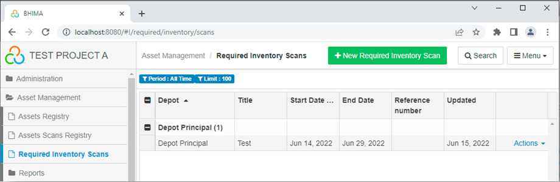

Relevant issues
- [[https://github.com/IMA-WorldHealth/bhima/issues/6350][Issue 6350]]

# Asset Management in BHIMA

## Background

A common need in many organizations and projects is to keep track of valuable
assets (property) that are used by the organization. BHIMA provides tools to
support the tracking of such property as it is received, assigned to
responsible entities, and tracking its location and condition during the
lifetime of the property.

Before going into details about how asset management works in BHIMA, it is
useful to review some terms that will be used in the following documentation.

- **Asset** - *Assets* are any article of inventory that is considered
  
  valuable enough to the organization that it is important to track its
  location and condition during the lifetime of the article.  Typically,
  assets are things like computers, printers, office furniture, vehicles,
  electronic devices, and mobile phones.

  Assets are generally unique items.  Often assets are labeled by the
  manufacturer with a model and serial number.  Articles of pharmaceutical
  stock ("Lots" or batches) may be identified by a Lot ID but any of the
  individual items in that lot are equivalent to each other -- they are not
  unique and would not be considered assets.

  Note that assets are instances of particular inventory items.  So part of
  the data for an asset is defined by the inventory article (eg, manufacturer
  and model numbeer) and additional data is asset-specific (eg, asset serial
  number).

- **Barcode** label or **tag** - Generally, each asset will be given an ID
  
  when it comes into the possession of the organization. This ID will be an
  internal ID to the organization and is not related to any manufacturer-given
  ID such as a serial number. The organization-given ID number will get
  encoded in a label as a *barcode* (which we may refer to as a "tag*) and
  affixed to the asset as a permanent organization label or ID tag for the
  asset.  The ID number will be encoded using a barcode so that it can be
  scanned with a hand-held scanner or mobile phone for tracking purposes.

- **Assignment** - Assets are generally *Assigned* to an entity within an
  
  organization to use the asset to accomplish thier work. The entity that an
  asset is assigned to are then responsible for the asset.  An "entity" here
  could be a person or a department of the organization. For instance, a
  computer would often be assigned to an individual person.  However, a
  printer might be assigned to a deparment as a shared assets to be used by
  anyone in the department.  An asset that is not assigned to an entity is
  considered to assigned to the depot it resides in.

- **Asset Scan** or **Scan** is the act of verifying the location and
  
  condition of an asset.  This is usually done by physically *scanning* the
  barcode of the actual asset using an hand-held scanner or mobile phone. A
  key concept here is that the actual asset must be available physically in
  order to scan it.  The scan will record the location and time that the asset
  is scanned and optionally provide a way for the user to indicated the status
  of the item.  The purpose of scanning assets to is track the locations and
  condition and to verify that the assets can be found physically.  Asset
  scans allow the organization to conserve its assets and prevent theft.

- **Required Inventory Scans** - An organization will ensure that assets are
  being properly taken care of by periodically requiring all assets
  (inventories) to be scanned.  This might be on a yearly or quarterly basis.
  Generally such required inventory scans will require that all assets be
  scanned by a specific deadline.  How this happens is a policy decision for
  the organization, but a typical approach might be for upper management to
  require that each department scan all assets assigned to them by a deadline
  in advance of the organizations overall required inventory scan deadline.
  The department strff will scan all assets that are assigned to the
  department or to individuals in the department.

## Asset Management Operations in BHIMA

Asset management has a top-level menu in BHIMA.  Under it are three options:

  - [**Assets Registry**](#-assets-registry) - A listing of assets in the
    organization.  This page also shows the current assignment of each asset
    and supports changing asset assignments.
  - [**Assets Scans Registry**](#-assets-scan-registry) - A listing of all asset
    scans.  This page also supports creating new asset scans (using a barcode
    scanner).
  - [**Required Inventory Scans**](#-required-inventory-scans) - A listing of
    defined required inventory scans. This page supports creating and editing
    required inventory scans.  It also supports showing the asset scans that
    have been performed in fulfilment of the required inventory scan.

We will look at each of these pages and the functionality they offer in more
detail below.

### Assets Registry

In order to see a listing of assets for the organization, visit the `Assets Registry`
page:

  

  <i>menu</i> > Assets Management > <strong>Assets Registry</strong>  
   &rArr; Open the **Assets Registry** page.
  

Here is an example of what that might look like:

Here is a description of some of the columns in this display:

- **Depot** - The depot that currently maintains records for the asset.  Note
  that the \[**Search**\] option can be used to limit the grid display to one Depot.
- **Code** - The inventory code for the asset
- **Inventory** - The description for the inventory for this asset
- **Inventory Group** - The description for the inventory group for this asset
- **Asset Label** - the specific, unique label for this asset
- **Unit Cost** - the unit cost for this asset
- **Entry Date** - the date that the asset came into the control of its depot
- **Assigned to** - the entity that the asset is assigned to (if any)
- **Reference number** - an ID used to relate this to the source of the asset
- **Manufacturer brand** - The name of the manfacturer for this asset
- **Manufacturer model** - The model name that the manufacturer uses to
  identify this asset
- **Serial Number** - The unique serial number for this asset as given by the
  manufacturer (if any)
- **Actions** - A menu of "action" items that can be performed on this asset
- *Note* that there are other columns that are hidden by default but can be
  enabled via the main \[**Menu**\] > Columns option (such as status, date the
  current assignment was created, etc).

Other items in this display are:

- \[**+New Assignment**\] button - This will allow creating a new assignment for
  any unassigned asset.  To create a new assignment for a specific asset, this
  functionality is also available via the action menu (described below).
- \[**Grouping**\] - Allows grouping by inventory or inventory group
- \[**Search**\] - Enable search filters
- \[**Menu**\] - a menu of top-level actions:
  
  These menu items include:

  - **Columns** - Disable or enable the display of columns in the grid
  - **Save / Clear Grid Configuration** - Save or clear the current grid
    configuration (including which columns should be hidden or shown).  Note
    that if the "Save Grid Configuration" is not performed, the next time the
    user visits this page, any changes of column visibility will be reverted
    to the default.
  - **Download as PDF/CSV/Excel** - Download the current grid display as
    PDF, CSV, or Excel files.
  - **Current Assignments** - Generate a PDF report with all the current
    assignments.  Note that this report will be limited based on the current
    search filters.  Only assets with assignments will be shown.
  - **Scan Barcode** - This option allows you to scan a barcode and
    immediately limit the display to the asset corresponding to that barcode.

#### Assets Action Menu

At the end of each row in the Assets Registry, is an **Actions** menu with
options specific to the asset in that row. The actions menu will be different
based on whether the asset has no current assignment (left menu) or does have
a current assignment (right menu).  The functions in the actions menu are:

- **Barcode** - Show the barcode for this asset
- **Edit** - Edit this asset.  Note that this only allows you to edit the data
  for the asset that is specific to this asset. Other data for this asset that
  is specific to the underlying inventory item can only be edited in the
  Inventory registry.
- **View Asset in Inventory** - Show the underlying inventory item in the
  Inventory Registry
- **View Asset in Stock** - View the asset in the Articles in Stock registry
- **Show Asset Scans** - Show the asset scans for this asset item (in the
  Asset Scans Registry)
- **+Add Assignment** - If the asset has no current assignment, allow an
  assignment to be done.  Note that adding an assignment requires that any
  previous assignment be removed first.
- **Assignment Document** - Show the document of the current assignment (if
  there is one).
- **Remove Assignment** - Remove the current assignment.  Note that this will
  leave the asset unassigned.
- **Assignment History** - Shows the history of assignments for this asset.

### Assets Scan Registry

To see a listing of the scans of assets, visit the **Assets Scans Registry**:

  

  <i>menu</i> > Assets Management > <strong>Assets Scans Registry</strong>  
   &rArr; Open the **Assets Scans Registry** page.
  

Here is an example of what the assets scans registry might look like:

And here is a description of some of the columns in this grid:

- **Depot** - The depot that maintained records for this asset at the time of the scan.
  Note that this might not be its current depot.
- **Manufacturer brand** - The name of the manfacturer for this asset
- **Manufacturer model** - The model name that the manufacturer uses to
- **Asset Label** - the specific, unique label for this asset
- **Condition** - the condition of the asset at the time of this scan
- **Notes** - any extra notes about the asset
- **Scan Date** - the date that the asset was scanned
- **Assigned to** - the entity that the asset is assigned to (if any)
- **Actions** - A menu of "action" items that can be performed on this asset
  scan.  These include the ability to **Edit** an asset scan or to create a
  new asset scan for this specific asset (without requiring a barcode scan).
- *Note* that there are other columns that are hidden by default but can be
  enabled via the main \[**Menu**\] > Columns option (such as inventory info,
  serial number, the person who performed the scan, etc).

Other items in this display are:

- \[**+New Asset Scan**\] button - This will allow creating a new asset scan.
  The barcode reader is activated and the user would then scan the barcode for
  an asset and a dialog will pop up allowing additional (optional) information
  to be added (such as the current condition and notes about the asset).
- \[**Search**\] - Enable search filters
  
- \[**Menu**\] - a menu of top-level actions:
  These menu items include:

  - **Columns** - Disable or enable the display of columns in the grid
  - **Save / Clear Grid Configuration** - Save or clear the current grid
    configuration (including which columns should be hidden or shown).  Note
    that if the "Save Grid Configuration" is not performed, the next time the
    user visits this page, any changes of column visibility will be reverted
    to the default.
  - **Download as PDF/CSV/Excel** - Download the current grid display as
    PDF, CSV, or Excel files.

### Required Inventory Scans

In order to track assets effectively, it is important to require that all
assets are physically scanned on a regular basis.  To facilitate that the
BHIMA software provides "Required Inventory Scans" which are defined periods
(or campaigns) in which assets are to be scanned.

To see a listing of the required inventory scan campaigns, visit the
**Required Inventory Scans** page:

  

  <i>menu</i> > Assets Management > <strong>Required Inventory Scans</strong>  
   &rArr; Open the **Required Inventory Scans** page.
  

Here is an example of what the required inventory scans registry might look like:

The columns in this grid are:

- **Depot** - The depot that maintains records for the asset
- **Title** - The title or label for this required inventory scan
- **Start Date** - The date this required inventory scan starts
- **End Date** - The date this required inventory scan ends
- **Reference Number** - An option to limit the scans to assets matching the
  reference number.
- **Updated** - The last date that the parameters for this required inventory
  scan were upated.
- **Actions** - A menu of "action" items that can be performed on this
  required inventory scan.  These include the ability to **Edit** the
  parameters for this required inventory scan and to show a list of items
  which have been scanned (limited by the current search filters).

Other items in this display are:

- \[**+New Required Inventory Scan**\] button - This will allow creating a new
  required inventory scan.  This will be described in more detail below.
- \[**Search**\] - Enable search filters (eg, filter by depot)
- \[**Menu**\] - a menu of top-level actions including:
  - **Columns** - Disable or enable the display of columns in the grid
  - **Save / Clear Grid Configuration** - Save or clear the current grid
    configuration (including which columns should be hidden or shown).  Note
    that if the "Save Grid Configuration" is not performed, the next time the
    user visits this page, any changes of column visibility will be reverted
    to the default.

#### Creating a new Required Inventory Scan

To create a new required inventory scan campaign, click on the
\[**+New Required Inventory Scan**\] button.  This will pop up a dialog that
will let you specify the parameters for the campaign.  The fields for the
parameters of this required inventory scan campaign are:

- **Title** - The title or label for this required inventory scan
- **Start Date** - The date this required inventory scan starts.
- **End Date** - The date this required inventory scan ends
- **Reference Number** - An optional parameter to limit the scans to assets
  matching assets with this reference number
- **Description** - An optional description of this campaign
- **Depot** - Option to limit the campaign to only assets managed by a
  specific depot

Note that the only asset scans that would count to fulfill a specific campaign
are one that were done between its start and end dates.  This forces a new
scan of every asset to be done during the campaign.

#### Required Inventory Scan Reports
The BHIMA software also supports reports that enable tracking the process of a

required inventory scan campaign.  To create these reports, visit the **Needed Inventory Scans**
report page:

  

  <i>menu</i> > Assets Management > Reports > <strong>Needed Inventory Scans</strong>  
   &rArr; Open the **Needed Inventory Scans** page.
  

The operator can select the required inventory scan (by title) and then
specify what they want to see in the report:
 - **All covered inventory** - A report showing all assets covered by the campaign
 - **Scanned inventory** - A report showing assets already scanned in this campagin
 - **Unscanned inventory** - A report showing only assets still needing scans for this campaign

## Asset Tracking Policy

How to conduct a required inventory scan campaign is at the discretion of the
organization.  However here is how one organization performs this task:

- "Inventorying" (scanning all assets) was required once a year.
- A specific deadline was given for all assets to be scanned each year for the
  entire organization.
- In the month (or more) before the deadline, everyone was instructed to scan
  their assets (using special barcode scanning devices or smart phones). Only
  assets scans performed after the beginning of the campaign would count. In
  some cases administrative staff or IT folks would do a lot of the scanning.
  However individuals who were assigned assets were ultimately responsible to
  make sure their assets got scanned during the campaign.
- The administrative staff monitored what percent of items were scanned (since
  last year's inventory).
- In the last weeks before the deadline, the administrative staff would work
  directly with people or departments who had not completed their scanning to
  get it done before the deadline.
- In the last week, the department head would warn people who had not
  completed their scans that it would count against them on their next review
  if their scans were not completed before the deadline.
- Occasionally, items could not be found or were known to be lost. There was
  a procedure to handle these cases but usually require manager approvals.
- Failures of departments to get all their assets scanned was a black mark
  against the department that was reported up to higher levels in the
  organization. The reviews of these upper-level managers were probably
  impacted negatively in such cases. So each department was eager to get
  their scans completed early.  The administrators of many departments
  required the scans for their department be completed a month in advance to
  avoid last minute scrambles.

