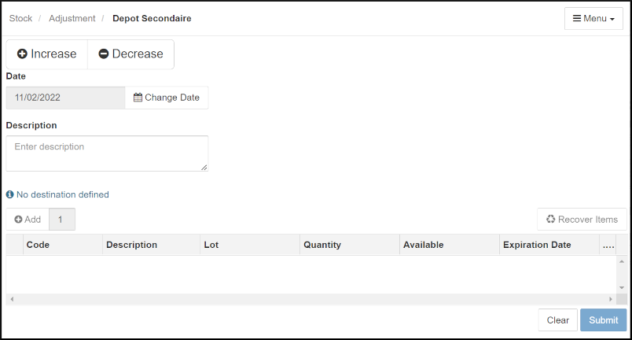
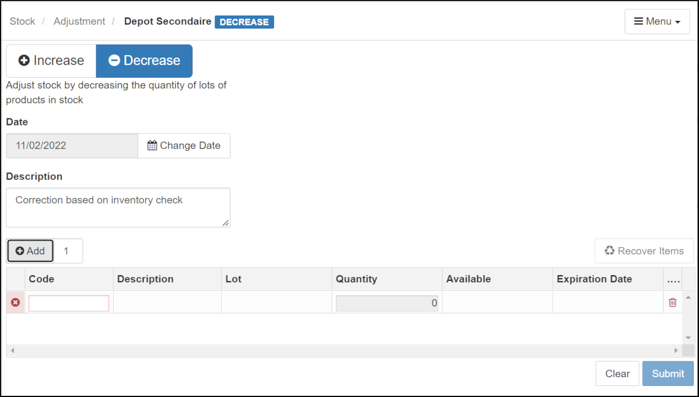
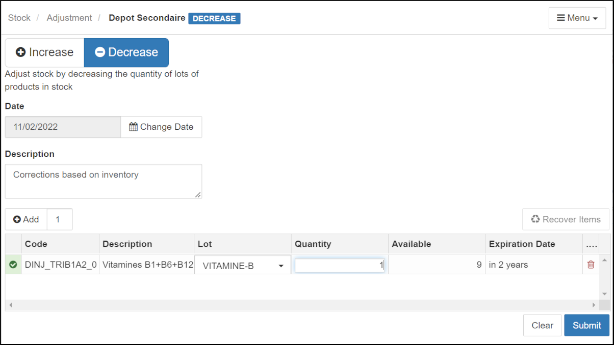

&raquo; [Home](../index.md) / [Inventory Management](./index.md) /  [stocks movements](./movement.md) / Stock Adjustment

# Stock Adjustment

In other sections we review the normal types of stock entry (Purchase,
Donation, Integration, Transfer).  However, there is another form of stock
entry which is similar to integration but which in reality is different:
"Adjustment".  Adjustment is used when, during an inventory of stock or any
other occasion, it is noted that the physical quantity observed is different
from the quantity in the database (theoretical quantity).  Integration, on the
other hand, is used when the stock has never been registered in the system
(database).

To perform stock adjustments, go to the Stock Adjustment page:

  

  <i>menu</i> > Stock > <strong>Adjustment</strong>  
   &rArr; Opens the form for adjusting stock quantities
  

- Do not forget that for any operation that affects a depot you must first
  make sure that you are operating on the depot concerned; if not, change the depot
  using the **[Menu]** on the top right and choose the "Change Depot" item.  A
  dialog allowing you to choose the appropriate depot will appear.  Choose the
  desired depot and click on the **[Submit]** button.  You will see the main
  Adjustments page again.

- There are two buttons at the top of the interface.  On the left: "Increase"
  (preceded by a positive sign) and "Decrease" (preceded by a negative
  sign). Naturally, click on "Increase", button when it is a question of
  increasing the theoretical quantity; and on the "Decrease" button, when it
  is a question of decreasing the theoretical quantity.

- If desired, change the date of the adjustment by clicking on the "Change
  Date" button which comes immediately after the date.

- The "Description" area allows you to describe the operation. Click in the
  box below "Description" and type in the description.

- Click on the "Add" button on the left at the top of the description table,
  to activate the lines used to insert the adjustment data from left to right.

- The updated form will be displayed.

  

- In the "Code" column, enter the a few characters in the name of the stock
  item.  A list of items with inventory codes including those characters
  appears.  Click on the desired item to select it.

- Click on the relevant box in the "lot" column.  The system will show the
  different existing lots.  Select the relevant one by clicking on it.

- The "available" column will then be activated and indicates the quantity in
  stock and the expiration date. The adjustment data must be entered in the
  "Quantity" column.

- NOTE: We write only the quantity to be added if it is an increase, and the
  quantity to be subtracted if it is a decrease. The system itself performs
  the "Addition" or "Subtraction" operation as appropriate.

- In this example, we are decreasing the count by one:

  

- Then click on the blue "Submit" button to confirm the adjustment.
