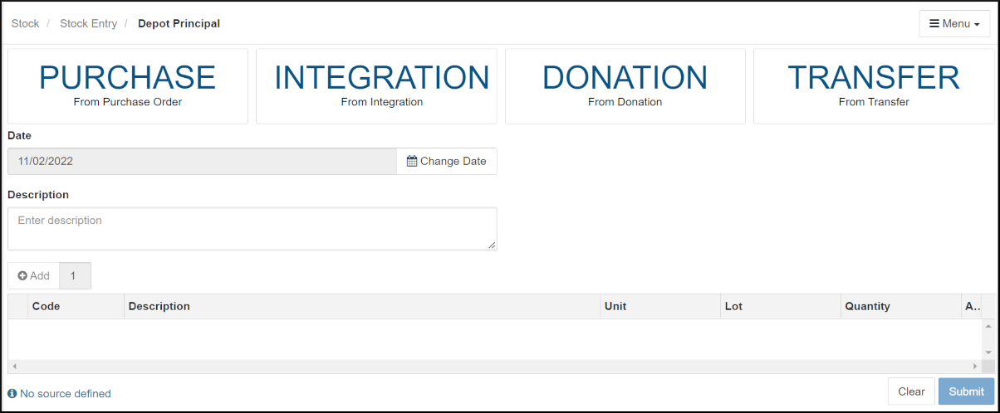
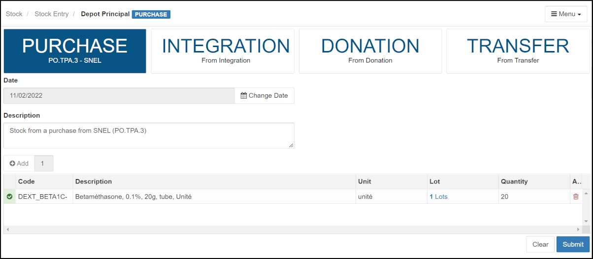

&raquo; [Home](../index.md) / [Stock Management](./index.md) / [Stock Movements](./movement.md) / Stock Entry

# Stock Entry

There are four ways that stock enters a depot that will be described in detail below:
- [From a purchase](#stock-entry-by-purchase)
- [By "integration"](#stock-entry-by-integration)
- [From a donation](#stock-entry-by-donation)
- [From a transfer from another depot](#stock-entry-by-transfer)

Before a depot or pharmacy gets stock to "enter", it is necessary to determine
how much stock is needed.  Depots typically need that information to put
together a purchase order.  Pharmacies typically need this information to
request stock from a depot.  In any case, computations of how much stock is
being used (per month) is helpful.  This is provided by the "Average Monthly
Consumption".  For more detaisl about that, please see the [section on Average
Monthly stock Consumption](./average-monthly-consumption.md).

## Stock Entry by Purchase
The process of purchasing stock for a depot includes several steps.
1. [Create a purchase order](#create-a-purchase-order)
2. [Confirm a purchase order](#confirm-a-purchase-order)
3. [Receive and enter stock from a purchase order](#receive-and-enter-stock-from-a-purchase-order)

---

### Create a purchase order

To create a purchase order, open the "Purchase Order" form:

  

  <i>menu</i> > Purchase Orders > <strong>Purchase</strong>  
   &rArr; Opens a new purchase order form
  

This will bring up a form like this:

 - Fill the form from top to bottom. 

 - On the "Supplier" field, the caret on the right suggests that there is a
   list of pre-configured suppliers. Click on the field to bring up the list,
   then select the supplier concerned by clicking on it.

 - To the right of the Supplier field, on the right, there is a "Date" field
   with a suggested date; if you wish to change it, click on the button on the
   right corner "Change the date".

 - Below the name of the supplier, the system offers you three options for the
   payment method; click on the small circle to the left of the desired
   payment method,

 - Click on the "Note(s)" field to activate the cursor to insert the
   description or notes related to the order.

 - The following table is for the items requested in the Purchase order. Enter
   the items of the order by clicking on the "Code" field.  This lets you type
   into the field. As soon as you enter a few characters of the item, the
   system offers you a list of products that contain those letters. Click on
   the desired item to select it.  The other fields on the same line, from
   left to right, become active as you go along, fill each field by clicking
   on it including quantity desired and requested unit purchase price.

   Initially, the form will show a single line for one item.  To add rows for
   more items, click on the "Add" button just above the top left corner of the
   table and fill them out as needed.  Items can be removed by clicking the
   Trashcan icon on the right end of the row.

 - To confirm and save the order, click on the "Save" button at the bottom of
   the form on the right.

 - To abort creating the purchase order, click on the **[Clear]** button on
   the bottom right of the form.

### Confirm a purchase order

Once a purchase order has been issued it is transmitted to the Supplier.  It
is possible that a purchase order may need editing to correct unit purchase
price, etc.  This can be done in the "Purchase Order Registry":

  

  <i>menu</i> > Purchase Orders > <strong>Purchase Registry</strong>  
   &rArr; Opens the registry of purchase orders
  

By opening the **Action** menu on the right end of the line for a specific
purchase order, you may click on the "Edit" link to edit the purchase order.
This Action menu also has a link to print the "Document" for the purchase
order.  It is likely that this will be needed during the process of receiving
the actual stock when the order arrives.

Once the supplier has confirmed that they can provide the stock, you need to
change the status of the purchase order.  To do this, use the **Action** menu
for the purchase order and click on the "Edit Status" link and change the status to "Confirmed".

WARNING: Once a purchase order is confirmed, it can no longer be edited.

### Receive and enter stock from a purchase order

When a delivery stock for a purchase order arrives and the requesting depot,
it is necessary to "Enter" this stock.  This involves two things: (1)
Physically unpacking the stock and confirming that all requested stock has
arrived, and (2) registering the entry of the stock in the BHIMA software.  

First, we need to open the stock "Entry" form:

  

  <i>menu</i> > Stock > <strong>Stock Entry</strong>  
   &rArr; Opens the form for entering stock
  

- First, make sure you have the correct depot selected.  If not use "Choose
  Depot" link under the the **[Menu]** button on the top right to correct it.

- Next, click on the "Purchase" box on the top left to select the source for
  the entry. This will bring up a list of purchase orders for you to choose
  from.

  

  - You can verify the purchase order details by clicking on its "Reference"
    number (in blue).  This will bring up a Purchase Order receipt with
    details.  Click on the "Close" button on the bottom right when you are
    finished reviewing the details.

  - Once you have identified the correct purchase order, click on the check
    mark to the left of the "Reference" identifier (circled in red here).  It
    should change color from light gray to dark gray and the whole line should
    be highlighted.

  - Press the blue **[Submit]** button at the bottom right of the form to
    confirm.

  - This will bring up the entry form pre-populated with the stock items from
    the purchase order.

- Once the pre-populated Entry appears it looks like this:

  

  - Notice that the source ("Purchase") is highlighted, that a suggested
    description is entered, and the stock items from the Purchase order are
    listed.  Update the description as appropriate.

  - However, notice that the red X-mark to the left of the stock item line shows
    you that something still needs to be done.  In order to finish, we must
    specify the "Lots" entry for the item.  For further information about
    Lots, see the [glossary](./glossary.md).

  - Click on the blue "Lots" link (by its icon).  The Lot entry form will be
    displayed:
  
    

    - In the "Lot" field, enter an identifier for the incoming lot, then
      update the quantity and expiration date based on the actual items
      received.

      Normally the "Lot" field will be a unique lot identifier. Either select
      an existing lot or create a new lot ID.  Notice that there is Barcode
      scan button to the right of the "Lot" field.  This allows you to
      read the identifier from a barcode on the item, if present.
	
       - The quantity must not exceed the overall "Global Quantity" at the top
         of the page which is taken from the original purchase order. If
         quantity is wrong, an error message will appear at the bottom of the
         page.

       - NOTE: The unit cost here is the default cost taken from the order
         form. Take care to replace it with the real purchase cost.

    - You can add as many lines as there are lots, by pressing the "Add"
      button on the left above the table.  This might be necessary if some of
      the delivered items are from different lots.

    - Once you are finished and there are no errors, click the "Submit" button
      to confirm.  This will take you back to the main entry form.

- Once you have completed entering the lot information for all incoming items,
  the entry is ready to submit:

  

  - Notice that the Stock entry line now has a green check mark on its left
    end indicating that it is now completed.

  - Now press the blue "Submit" button on the bottom right.  This completes
    the preparation of the stock entry by purchase order.  A Stock Entry
    receipt (voucher) is displayed which can be printed.

---

## Stock Entry by Integration

**What is an integration entry?** Assuming that during an inventory of stock,
  a stock item is found that has never been registered in the stock
  (inventory) in the BHIMA system.  Since it is neither a purchase nor a
  donation, but it must be included in the stock inventory, we use
  "integration" to do that.

**Here is how to proceed:**
Bring up the Stock Entry form:

  

  <i>menu</i> > Stock > <strong>Stock Entry</strong>  
   &rArr; Opens the form for entering stock
  

- Click on the "Integration" source at the top.  You should see a form like this:

  

  - Unlike the entry of stock by purchase which called on the purchase order,
    here, you start by first entering a required description of the reason for
    the integration (by clicking on the box under "Description").  No purchase
    order is needed.

  - Then click on "Add" button to add lines on table for adding new stock
    entries (by integration). From this point the operations are very similar
    to those for stock entry by purchase.

	 - Note that you will again edit the Lot field for each added item.
 	   However, in this case we have no purchase order, so you must enter the
 	   "Global Quantity" at the top of the Lot Entry form yourself.  If not,
 	   you will get an error message and will not be able to complete the Lot
 	   Entry form.

  - Once the lot entries are completed, click on the main **[Submit]** button
    to complete the entry.  You will be offered a document for the entry.

---

## Stock Entry by Donation

The procedure for entering stock by donations is no different from that by
integration -- but you specify that it is a donation entry by clicking on the
"donation" button which is then highlighted in blue.

Similar to stock entry by integration, there is no purchase order involved so
the Lot "Global Quantity" must be set appropriately on the lot selection
forms.

---

## Stock Entry by Transfer

Entry of stock by transfer from one depot to another is one of the typical
ways that stocks enter a depot's stock inventory.  The receiver could be
pharmacy or another depot.  However, requisitions for the transfers must
already exist for transfers to occur (more on this later).

Bring up the Stock Entry form:

  

  <i>menu</i> > Stock > <strong>Stock Entry</strong>  
   &rArr; Opens the form for entering stock
  

- **FIRST**, make sure the receiving Depot is selected (look on the
  "bread-crumb" line at the top of the form).  If the receiving depot is
  incorrect, select the correct one using the "Choose Depot" link under the
  **[Menu]** button on the top right of the form.

- Once the correct receiving depot/pharmacy is selected, click on the
  "Transfer" source at the top.  You will see a pop-up menu with the candidate
  transfers:

  

  Select the items to be entered from the originating depot by clicking on the
  small check mark on the left end of the line (circled in red here).  The
  check mark should change from light gray to dark gray.  Then click on the
  blue **[Submit]** button at the bottom of the dialog.

You should see the entry form like this:

- Note that you might not see all four sources (Purchase, Integration,
  Donation, Transfer) depending on how the Depot was configured.

- At this point, you may click on the blue "Lot" link on each entry line to
  update or correct the Lot identifier, quantity, and expiration date based
  on what was actually received.

- You may want to update the description field to describe more details about
  the delivery.

- Click on **[Submit]** at the bottom of the page to the right to confirm the
  stock entry and to update the local stock inventory.

- An entry voucher certifying entry into stock will be displayed. You can
  print it by clicking on the "Print" button (&#128438;) or download it using
  the "Download" button (&#11123;).
