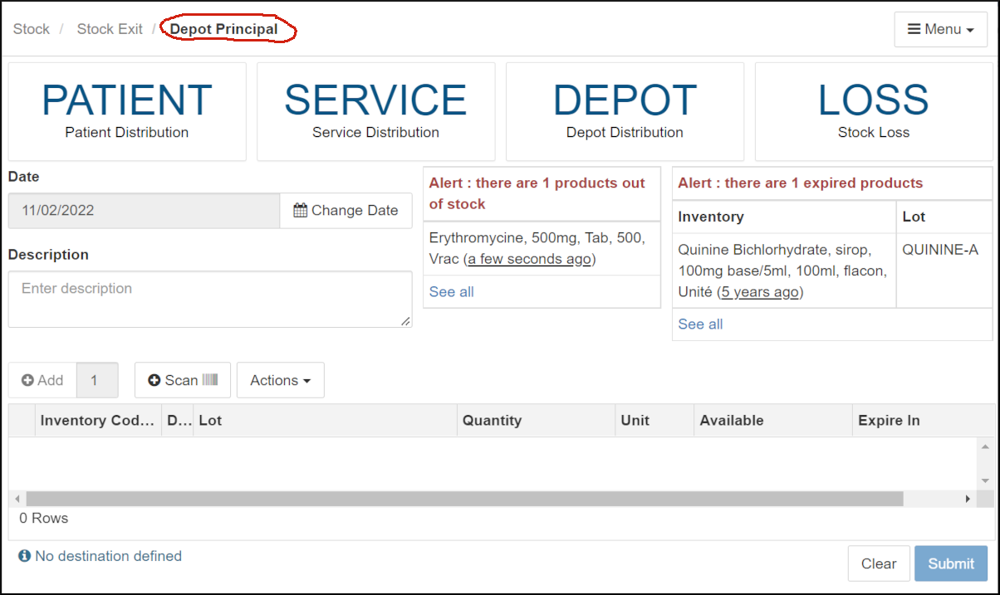
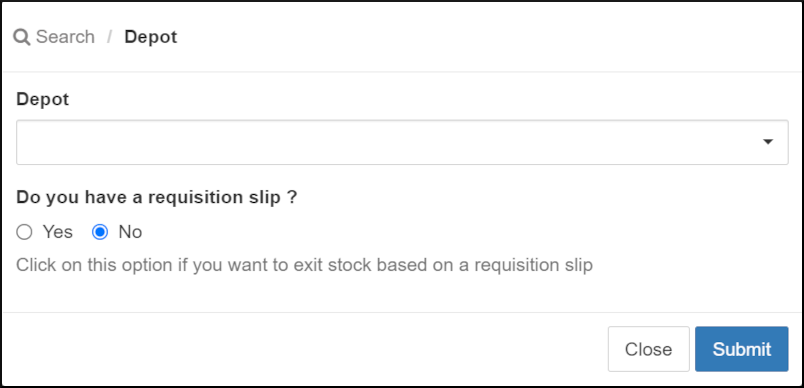
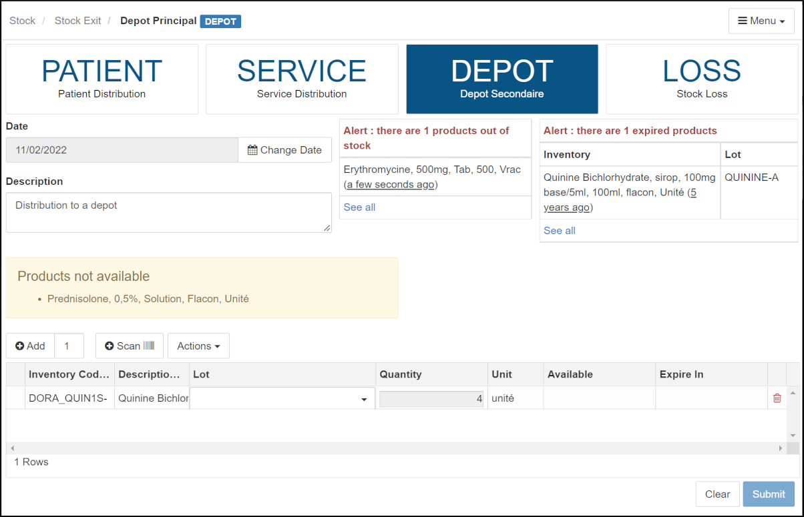
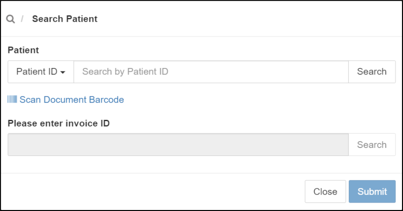
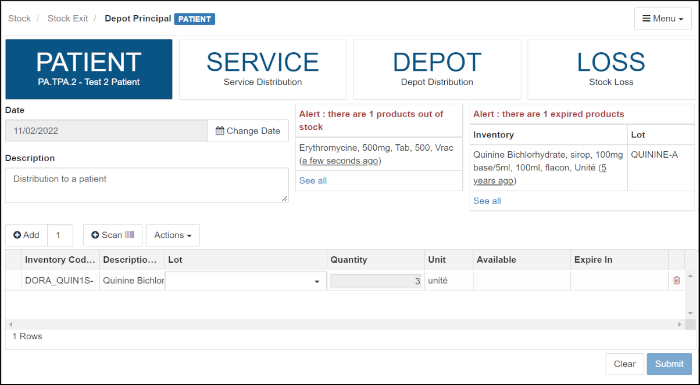
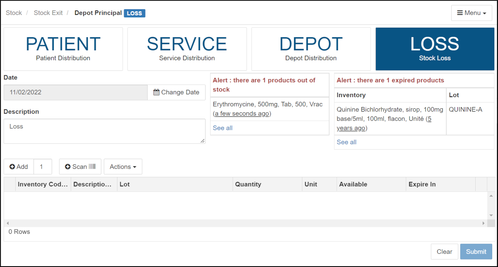

&raquo; [Home](../index.md) / [Inventory Management](./index.md) / [Stock Movements](./movement.md) / Stock Exit

# Stock Exit

Any outflows of stock from a depot is a stock exit in BHIMA. The exit of stock
concerns a stock pharmacy as well as a dispensing pharmacies.

 - **Movements of stock out of the stock pharmacies or depots** fall into the
   following cases:

    - **Transfer to Services** [^1] (Wards / Departments): In this case it is
      assumed that the services are authorized and keep small depot of stock
      items.  These are typical items such as laxatives, alcohol,
      anti-bacterial creams, etc.  In short, these are stock items for daily
      use that are difficult to quantify in advance to be part of a
      prescription issued for a specific patient.  This category may also
      include resuscitation and emergency use products that cannot wait for
      the patient to pay first at the counter before being served at the
      pharmacy.

    - **Transfer to other Depots or dispensing pharmacies**: Normally, patients
      are served directly at a dispensing pharmacy (or dispensary) when the
      dispensing pharmacy receives prescription (that have been paid for) at
      the counter, by means of a receipt ("proof of payment"), presented by
      the patient or a nurse.  Stock Pharmacies are usually the source of
      stock that is transferred to Dispensing Pharmacies.

    - **Losses**: Losses are also taken into account here.  This the losses
      themselves, breakages, as well as lapses???.  It is advisable to remove
      the lost items from the stock inventory.

 - The movements of stock out of the dispensing pharmacy occur in the
   following cases:

    - **Stock items transferred to patients** [^1].  As above, patients with
      prescriptions with proof of payment are directly served at the
      dispensing pharmacy. These outflows are recorded, valued and constitute,
      to a large extent, the largest proportion of the source of the drugs
      (stock) consumed / sold.  These stock movements should be carried in the
      expense part of the operating account.

    - **Losses**: Like the stock pharmacy, the losses themselves, breakages as
      well as lapses are the main reasons for causing exit of stock from the
      usual pharmacy (in terms of loss).

NOTE: When the losses of stock cause the inventory of a stock item to be
depleted, we call that "Out of Stock" or a "Stock Out".

Stock exits to a patient, service, or to loss effectively removes stock items
from the enterprise.  The only way to replenish stock after an exit is made is
to receive more stock by an Entry.

Now we will show how to do each type of stock exit:
- [Stock Exit to a Depot or Service](#stock-exit-to-a-depot-or-service)
- [Stock Exit to a Patient](#stock-exit-to-a-patient)
- [Stock Exit by Loss](#stock-exit-by-loss)

---

## Stock Exit to a Depot or Service

First, we need to open the stock "Exit" form:

  

  <i>menu</i> > Stock > <strong>Stock Exit</strong>  
   &rArr; Opens the form for exiting stock
  

First, make sure that depot sending/exiting the stock is selected (note the
circled Depot in the "bread crumb" path at the top of the form).  If it is not
the correct depot, using the "Change Depot" link under the **[Menu]** on the
top right of the form to select the correct depot and click **[Submit]]**.

Note that there are areas on the page (to the right of the date field)
indicating any stock that is out of stock or expired.

Exiting to a Depot or to a Service works very similarly.  For exiting to a
Depot, click on the large **[DEPOT]** button the top of the page.  To exit to
a Service, click on the large **[SERVICE]** button.  After that, the forms
works the same.

After clicking on the large **[DEPOT]** destination button on the top of the
form, we will see a depot selection form:

  

Select the desired depot or pharmacy. If you have a requisition, click on
"Yes" for that item and then select the requisition.

- Note that there is a registry for requisitions that allows listing, editing,
  and creating requisitions:

  

  

  <i>menu</i> > Stock > <strong>Requistion</strong>  
  &rArr; Opens the Requisition registry
  

  

Once the depot and requisition is selected, click on the **[Submit]**
button to get the main exit to depot form:

  

The requisition used in this example had two stock items.  However, one was
out of stock (shown in the yellow block), so the main form only lists one
item.

 - Enter the reason for stock exits in the "Description" field. 

 - If a requistion was not used, the form will be blank and the user will need
   to use the **[Add]** button at the top left of the exiting stock items
   table to add new blank items.

 - For each line in the table with blanks

	- In the "Inventory Code" box (bordered in red), enter characters from the
      desired stock item.  A list will appear with matching characters.
      Select the desired stock item by clicking on it.

	- Click on the "Lot" field to choose the appropriate lot.

	- In the "Quantity" field, enter the number of exiting items.  Note that
      this must be less than or equal to the number listed in the "Available"
      column.

 - When the details for all exiting items are completed, click on **[Submit]**
   to confirm.

 - An exit voucher will be generated which can be printed, if desired.

---

## Stock Exit to a Patient

First, we need to open the stock "Exit" form:

  

  <i>menu</i> > Stock > <strong>Stock Exit</strong>  
   &rArr; Opens the form for exiting stock
  

After clicking on the large **[Patient]** button, you will be prompted to
chose the patient to receive the stock.

  

   - Click in the small box labeled "Patient ID" on the left (indicated by the
     blue arrow) to choose the type of patient search. By default, the system
     lets you the search by patient ID. You can change the type of search, by
     clicking in the box. The system offers 3 types of search (by ID / code,
     by patient name or by barcode scanner). Select the type of search desired
     by clicking on it.

   - If a barcode reader is being used, scan the barcode now.  If not, enter
     in the search box on the right, the patient's identifier or name,
     depending on whether the choice was made for a search by ID or by
     name. Enter the characters of the user's ID or name in the search field.
     The system will suggest all matching names. Select the desired patient by
     clicking on the desired name/ID.  It will then appear in the search box.

   - Note that exits to patients now require an invoice.  Invoices here are
     essentially prescriptions and are usually created by the medical staff
     (using <i>menu</i> > Finance > Invoice).

     If a barcode from an invoice is scanned, the patient ID and invoice will
     be handled automatically.  If not, once a patient ID is entered, the form
     will be populated with available invoices and the user can select the
     correct only.

When the patient selection form is complete, click on the blue **[Submit]**
button. The Stock Exit form will be redisplayed with the name of the patient
with blue highlighting.

 - Then we follow the same process as before in terms of adding stock items to
   be dispensed to the patient (stock exits).  Fill the form from top to
   bottom.

 - Change the date if necessary.

 - In the "Description" field, complete the description as appropriate.

 - Add stock items by clicking on the "Add" button.

 - Complete filling out each line using the same process as in previous
   descriptions of recording stock exits.

 - Once the process is complete, press the blue "Submit" button on the bottom
   left.

 - A patient delivery slip will be displayed which can be printed.

---

## Stock Exit by Loss

To record a stock exit due to loss, from the "Stock Exit" page, click on the
big **[Loss]** button at the top of the form.  Since there is no depot or
service to involved, it is just a loss and the system gives you direct access
to the exit voucher to be completed. Here is what the form Loss page looks
like.

- Make sure that the correct Depot is selected.

- To complete the form, follow the same logic as for stock exits to a depot or
  service.

[^1]: Stock exits to patients and services are _consumptions_ and influence
the Average Monthly Consumption (AMC).  For more information, see the
[Stock Settings Page](./stock.settings.md).
