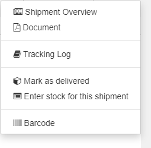
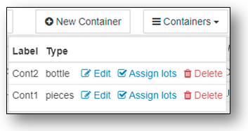

&raquo; [Home](../index.md) / [Stock Management](./index.md) / [Stock Movements](./movement.md) / Shipments

# Shipments

When stock is transferred from one depot to another, it is called a "shipment".  This could be involve collecting stock in one depot and shipping it via truck to another depot in an entirely different location.  Or it could simply be taking some stock from one depot to another in the same building.   For instance, purchasing and receiving stock from external suppliers is often done through a primary depot, while a pharmacy is also considered a "depot" in BHIMA. So once stock is received in the primary depot, transferring it to a pharmacy in the same building would still be considered a shipment.

Shipments are restricted to transferring stock from one depot to another.   These involve stock exits (from the sending depot) and stock entry (into the receiving depot).   Technically, transferring stock from one depot to another could be done by directly using the Stock Exit and Stock Entry interfaces and not directly using the Shipping interface.  However, users should be aware that even if the shipment interface is not directly used, a shipment is still created when stock is exited from one depot and sent to another.  Other types of stock exits (such as exit to "Loss") or stock entries (such as entry by "Integration") do not involve BHIMA "Shipments".

## The BHIMA Shipments interface

In the BHIMA interface, there is  "Shipments" menu entry in the top-level menu:

There are two entries under the "Shipments" menu:
1. New Shipment - Create a new shipment
2. Shipment Registry - Display shipments with status and actions that can be performed on them.

## The Lifecycle of a Shipment
Shipments can be the following states:
- **Empty** - the order has been created but contains no stock
- **At depot** - the shipment has been created but not finalized
- **Ready for shipment** - The shipment packing list is finalized
- **In transit** - The shipment is in transit.  Stock exit has been performed by origin depot.
- **Delivered** - The order has been received but not unpacked or entered into stock
- **Partial** - Partially Received by the receiving depot
- **Complete** - The order has been completed (sent and received).
  Stock entry has been performed by destination depot.  It is possible that all items sent were
  not received due to losses, theft, etc.
- **Lost** - The entire order was lost (e.g. lost in transit)

Shipments go through several phases during their lifetime (these phases are related to the states listed above):
1. **Creation** - In this step, a shipment is created including information about
   - the sending and receiving depots
   - expected arrival date, and
   - a packing list of stock to be shipped.
Immediately after the creation of a shipment, it is marked as *empty*.  Once items are added, the status changes to *at depot*.
During creation, it is still possible to update the packing list of items in the shipment. Once the shipment container is completely packed, the origin depot proceeds to the next step.
2. **Marked as "Ready to Ship"** - At some point, the user needs to declare that the shipment marked as complete and ready to ship.   For instance, this could be when the container for the shipment is closed and ready to be shipped.  Once a shipment is marked as ready to ship, the contents (packing list) of the shipment cannot be changed.
3. **Stock Exit** - After a shipment is ready to ship, the stock involved needs to be "exited" from the sending depot.  Up to this point, the packing list for a shipment is only tentative.  It is still possible to delete the shipment at this point.  When the stock exit for a shipment is performed, the stock is removed from the sending depot and is considered to be in transit.  Once the stock exit for a shipment occurs, the shipment can no longer be deleted.  Doing the "Stock Exit" for a shipment is easily accomplished using the action menu for the shipment in the Shipment Registry.
4. **Departure from sending depot** - After the stock exit for a shipment is complete, it is marked as *in transit*.  It is possible for a shipment to be present in the origin depot and still be *in transit*.  When transportation has been arranged, it will physically depart from the origin depot.
6. **Transit** - The physical movement of the stock could be as complicated as sending the shipment in a container and by truck or airplane to another location.  Or it could be as simple as walking a few items to another room in the same building.  While this occurs it is in transit.  There are means in the Shipment Registry for updating the location and condition while it is in transit.
7. **Arrival at the Receiving Depot** - Once the shipment arrives at the destination depot, the personnel of the destination depot will indicate that the shipment has been received.  The shipment is then marked as *delivered*.  At this point it is ready for stock entry by the destination depot.   However, until stock entry occurs, the stock is still not officially in any depot.
8. **Stock Entry** - As the shipment is deposited in the receiving depot, the BHIMA software needs to be updated.  This is accomplished by doing the "Stock Entry" for the receiving depot.  Generally, once the stock entry occurs, the shipment is marked as complete.  Once the stock entry has occurred at the destination depot for for **all items** in a shipment, the shipment is automatically marked as *complete* -- otherwise it is marked as *Partial*.  Note that it is possible that some shipment items are lost in transit due to spoilage or theft.  The shipment could still be marked as complete in that case, but that would need to be done manually via the Shipments Registry action menu.

## Example Shipment Process
The purpose of this example is to show the basic use of the BHIMA interface for shipments and how using the Shipments interface simplifies the process of sending stock from one depot to another.

### Creating the shipment
Suppose you want to ship several articles of stock from the "Primary Depot" to a "Secondary Depot".  Start by going to the BHIMA `New Shipment` page.

  

  <i>menu</i> > Shipments > <strong>New Shipment</strong>  
   &rArr; Opens the form for creating a new shipment
  

You will see a page like this partially completed form.

The items in red indicate necessary inputs to complete the form:

1. This item in blue shows the currently selected source depot.  If no depot has been selected, you will be prompted to chose a source depot before the form will be shown.  If the depot shown here is not the correct depot, use the "Change Depot" item in the [Menu] on the top right of the page to select the correct source depot.
2. This area will shows the status of the shipment creation process and any alerts that need to be dealt with.
3. Enter a label (or name) for the shipment.  This is short identifier that the personnel both in the sending depot and receiving depot will recognize.
4. Select the depot to receive the shipment
5. Select the anticipated delivery date
6. Add explanatory notes (optional).  For instance if the shipment needs to be routed through some intermediate location, that could be shown here.  This is also an appropriate place to add notes about the urgency or fragility of the shipment.
7. When you are ready to add stock to the shipment, click on this [Add] button.  This will add lines for each item as desired.
8. Update and review articles of stock in the shipment.  You can think of this as the packing list.  Adding stock here works similarly to adding articles of stock in the Stock Exit form.  Here we show an empty line immediately after clicking on the [Add] button.  Select the article of stock to be added to the shipment by typing in an inventory code into the "Inventory Code" box and then selecting the desired lot and quantity.  You can add additional items by clicking the [Add] button again.  Note that the left end of each line in the packing list has a status indicator.  When the line is correctly filled out, the status indicator will show a small green check.
9. Once you have have added all the desired articles of stock to the shipment (and there are no warnings in the form), click on the [Submit] button to complete the shipment.

### Mark the order as ready to go
For this step, go to the `Shipment Registry` page.

  

  <i>menu</i> > Shipment > <strong>Shipment Registry</strong>  
   &rArr; Opens shipments registry
  

The shipment registry will show all shipments along with their status.  On the right end of each line is a link to open the action menu for that shipment.   Here is what the registry and action menu look like at this point (in the example):

When you click on the **Actions** link it will bring up a menu like this:

Here is a brief recap of the actions available at this point:

  a. These two commands show documentation for the shipment  
  b. The **Tracking Log** includes all events in the life of the shipment and allows the user to add additional comments as appropriate.  For instance the user could add a comment indicating that the shipment has arrives at some intermediate location.  
  c. **Update Packing List** allows the user to edit or update the shipment including editing the packing list.  
  d. Mark the shipment **Ready to Ship**  
  e. Display the **Barcode** for this shipment  
  f. Delete the shipment.

To complete this step in the example, select the "Ready to Ship" option and confirm the action in the modal dialog.

**NOTE**: An important thing to note about the action menu for shipments is that it will only display actions that can be done based on the current status of the shipment.   This makes it straightforward to process shipments since the action menu essentially guides the user through the normal process of dealing with shipments.

### Stock Exit at the Sending Depot
At this point, the shipment is ready to to be shipped and a stock exit should be performed as soon as possible. Although this could be done by going to the Stock Exit page directly, it is easier to go back to the `Shipments > Shipments Registry` page again and bring up the action menu for the shipment.  A new entry for the Stock Exit will appear:

Notice the new entry on the menu: "Exit stock for this shipment".  When you click on this action, it will take you directly to the Stock Exit page with the articles of stock in the shipment configured for quick approval. 

### Transit
Once the stock exit for a shipment has been performed, the the shipment (and contained stock) is considered to be in transit.  As far as BHIMA software is concerned this is a sort of "in limbo" state -- the items are tracked by the BHIMA software (via the shipment itself) but are no in any depot.   It is possible that the shipment will sit on the loading dock of the origin depot until it is loaded on a vehicle and physically leaves the sending facility.   Once the shipment leaves the sending depot, its transportation progress can be logged using the "Tracking Log" in the Shipments Registry action menu.

### Arrival at the Receiving Depot
Once a shipment arrives at the receiving depot, it will be unpacked and the items entered into the stock for the receiving depot.

### Stock Entry at the Receiving Depot
The Shipments interface makes this straightforward.  Go back to the Shipments Registry and open the action menu for the desired shipment.  There are two actions that are now available:

   1. **Mark as Delivered** - This will change the status of the shipment to *delivered*.  This does NOT mean that stock entry has been performed at the destination depot.  Chosing this option means that the shipment has been received but not unpacked.

   2. **Enter stock for this shipment** -
   Selecting this option will take the user to Stock Entry page for the shipment with all the relevant information set up for easy approval.  Note that marking the item as *delivered* can be skipped if the shipment has already been unpacked when the stock entry into BHIMA is ready to be done.

Note at this point, if the Stock Entry is approved with all items received, the shipment will automatically be closed (marked "Complete").  However, if any items are missing or lost due to damage, the shipment status will be marked as "Partial".  It can remain in the "partial" state as appropriate, but it can be manually closed (via the action menu after the stock exit).

### Creating Shipments with Containers

The examples above assume that all items in a shipment will be sent in one
container.   BHIMA also supports breaking a shipment into multiple separate
containers.  There are additional controls on the interface to create
shipments to support this.  For example:

1. **\[+ New Container\]** button -- Create a new container
2. **\[Containers\]** button -- A drop-down menu of operations that can be
  performed on the containers for this shipment. Note that this button will
  not be shown if there are no containers. The operations available are
  **Edit**, **Assign lots**, and **Delete**.
3. *Container choice* - This item shows which container is selected for the
  shipment item. (Not visible if there are no containers).  This is a
  drop-down menu of the available containers.  This can also be used to select
  an alternate container.
4. *Multiple lot select* checkbox - You can assign multiple shipment items
  (lots) to a container by using this checkbox and then using the "Assign
  Lots" option for the desired container in the container operations menu.

When the **\[Containers\]** menu is opened, it appears like this:

The options for each container are:
- **Edit** - Edit the container
- **Assign lots** - If this command is executed, all shipment items (lots)
  whos "Multiple lot select* checkbox are checked will be reassigned to this
  container.
- **Delete** - Deletes the container.  All items in that container will be not
  be assigned a new container.

