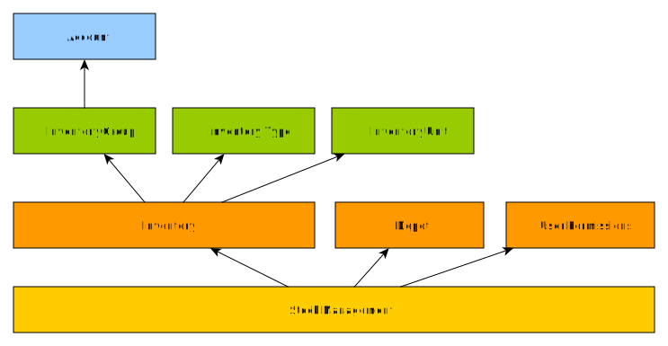

&raquo; [Home](../index.md) / [Inventory Management](./index.md) / Overview of Inventory Management

# Overview of Inventory Management

## Terminology

Before discussing inventory and stock management in BHIMA, we must establish some terminology.

In BHIMA, **inventory** is used to define the concept of goods and services that can be purchased and sold and are
referred to with codes and names.  The physical items received some suppliers and housed in the depot are called **stock**
and are referred to by lot numbers.

To help clarify the difference between stock and inventory, it is useful to consider what properties
apply to each.

The following are properties of **inventory**:
 1. **Name** - the name of the good or service that can be bought and sold
 2. **Cost of Goods Sold (COGS) Account** - each item of stock is valued at the purchase price.  When a good is sold or lost, an expense is recorded in the cost of goods sold account.
 3. **Stock Account** - once purchased, the value of the goods are written into the stock account.
 4. **Sales Account** - the sales account is credited for every sale of the good.  To understand if you are making a profit on sales, the value of the sales account is compared to the cost of goods sold account.  If the value is higher, the institution is making a profit.

The following are properties of **stock**:
 1. **Purchase Price** - each stock item is bought from a vendor at a price. This is the purchase price.
 2. **Expiration Date** - perishable stock will have an expiration date.  This date will differ from lot to lot.
 3. **Lot Number** - the identifier used to distinguish between different articles in stock.  Often, this is issued by the manufacturer.

<h4>A Philosophical Analogy</h4>
If you are still struggling to understand the relationship between stock and inventory, a useful analogy is that <i>inventory</i> is a platonic form and <i>stock</i> is the physical manifestation of that form.  The institutions sells the inventory item of "Quinine in 500 milligram capsules", but it may not be in stock.  If it is in stock, a particular lot of Quinine might have an expiration date that is different from other Quinines in stock.

## Features of Stock Management

Stock management in BHIMA has some powerful features:

- A stock sheet containing the entries, exists, and balance of each article in stock is available in real time
- Real-time valuation of the hospital's stock assets, including real-time computation of Cost of Goods Sold (COGS)
- Easy access to stock status reports
- Entry of stock into depots/pharmacies from:
    - Purchases
    - Integrations
    - Donations
    - Other depots/pharmacies
- Exists of stock from depots/pharamcies to:
    - Patients, optionally linking an invoice
    - Services
    - Other depots/pharmacies
    - Record losses
- Adjustments to stock levels during routine inventory
- Assign stock to individuals
- Consult stock registries:
    - The stock lots registry
    - The articles in stock registry
    - The stock movements registry

### Stock Management's Dependencies

To manage stock with BHIMA there are some dependencies that must be completed beforehand.

This management requires certain prerequisites:

- **The presence of depots**: stocks are always in depots, from which you can not manage stocks without defining depots.

- **The presence of inventories**: the inventories in BHIMA are the information on articles or services, but in the context of the stock it is the information on articles that can be stored in depots

- **The presence of users with the required permissions on the depots**: BHIMA has a permission policy on depots, that is to say that only authorized users can have access to a given repository

### Stock Management & Accounting
Stock management in BHIMA can be a standalone package or work in concert with the finance modules.  When automatic stock accounting
is turned on, BHIMA will create writings in the appropriately configured accounts for these items.  If automatic stock accounting
is turned off, the system will simply move stock around.

