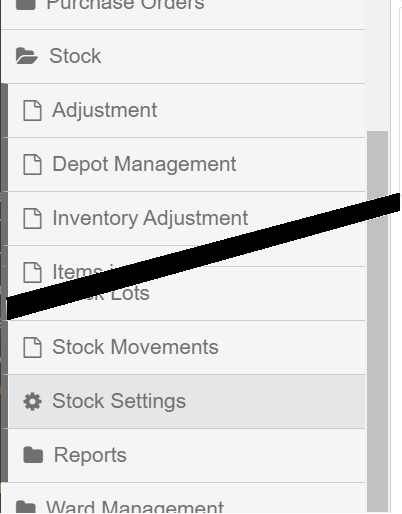

&raquo; [Home](../index.md) / [Inventory Management](./index.md) / Stock Settings

# Stock Settings

There a number of settings that affect how the BHIMA software deals with stock management.  To check and update the settings, one goes to the "Stock Settings" page (under the "Stock" menu):

If you do not see the "Stock Settings" menu item, consult your system adminstrator.  You need to be given permission to access that page [^1].

[^1]: Under `Administration > Role Management`, click on the action menu on the right end of the desired user.  In the action menu, click on `Permission`.  Scroll down to "Stock Settings" (at the end of the Stock items), click the check box and the [Save] button.  The Stock Settings page should now be accessible for that user.
