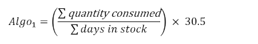
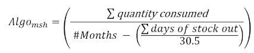

&raquo; [Home](../index.md) / [Inventory Management](./index.md) / Stock Settings

# Stock Settings

There are a number of settings that affect how the BHIMA software deals with
stock management.  To check and update the settings, one goes to the "Stock
Settings" page (under the "Stock" folder):

If you do not see the "Stock Settings" menu item, consult your system
adminstrator.  You need to be given permission to access that page.

- To add permission for a user to access the "Stock Settings' page: Under
  `Administration > Role Management`, click on the action menu on the right
  end of the desired user.  In the action menu, click on `Permission`.  Scroll
  down to "Stock Settings" (at the end of the Stock items), then click the check
  box and the [Save] button.  The Stock Settings page should now be accessible
  for the user.

## AMC - Average Monthly Consumption

For the following Stock Setting options, the term "AMC" is used.  It
represents "Average Monthy Consumption" of stock.  AMC is the total number of
stock items dispensed on average to **patients and services** for the
facility involved.  AMC is an important value that used to estimate when to
order more stock.

## Individual Stock Settings
The Stock Settings page allows access to the following items:

- **Number of months for calculating the average monthly consumption** (integer, default 6 months)
  This determines the number of months (**N**) in the past to use to estimate
  the average monthly consumption. The AMC is a "moving" average, since
  it uses a window of only the previous **N** months to determine the
  average. This setting will set the value of **N**.

- **Default minimum number of months of security stock for depots** (integer, default 2 months)
  The stock supply should provide at least this many months of stock at
  all times for the depot involved.

- **Minimum Purchase Delay**
  Sets the minumum amount of expected delay in months for a supplier to deliver medicines after
  the purchase order is finalised.

- **Enable automatic confirmation of purchase orders** (yes/NO)
  Enable automatic confirmation of purchase orders when they are created
  without requiring manual confirmation

- **Enable permission to view depots in stock registries** (yes/NO)
  Limit the consultation of stock registries to users according to their
  depots

- **Enable automatic stock accounting** (YES/no)
  Enabling this feature will write stock movement transactions into the
  posting journal in automatically, in real time. It requires all inventory
  accounts to be correctly configured.

- **Enable automatic crediting of supplier on stock entry** (yes/NO)
  Automatically adds the transactions to credit the supplier for the value of
  stock received in a depot when entering stock from a purchase order. This is
  only triggered if the automatic stock accounting is set as well.

- **Activate the restriction of distribution depots** (yes/NO)
  Limits the depots a user can interact with to the depots that the user has
  access to. Thus, if a user cannot distribute stock from a depot, they also
  cannot transfer stock to that depot.

- **Algorithm for calculating Average Monthly Consumption (AMC)**.
  Possible choices:

  - **Default Algorithm**: The average monthly consumption is obtained by
    dividing the quantity consumed during the period by the number of
    days having stock for the period, and by multiplying the result
    by 30.5.

    

  - **MSH Algorithm** (default): The average consumption is obtained
    by dividing the quantity consumed during the period by the
    difference of number of months in the period minus the total number
    of days of stock out in the period.  The MSH algorithm is
    recommended by the **M**anagement **S**ciences for **H**ealth
    organization (https://www.msh.org).

    
