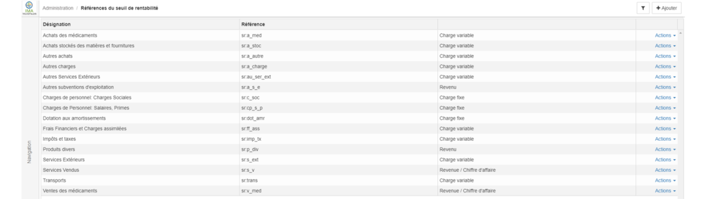

> [Accueil](../index) / [Seuil de rentabilité](./index) / Configuration du rapport seuil de rentabilité dans BHIMA 2X 

# Configuration du rapport seuil de rentabilité dans BHIMA 2X 

La première étape pour la configuration du rapport de seuil de rentabilité est celui de la création des références des comptes. <em>« Les références des comptes liées au seuil de rentabilités doivent avoir le type de référence des références des comptes <strong>Seuil de rentabilité</strong>»</em>
La deuxième étape est celui de la création des <strong>références du seuil de rentabilité</strong>, l’interface permettant de gérer les références du seuil de rentabilité se trouve dans le menu administration.
L’interface principale permettant de la création des références du Seuil de rentabilité se présente de la manière suivante.

Il existe à l’extrême droit le bouton + Ajouter, qui permet d’ajouter une référence. Voici les éléments à fournir pour enregistrer une référence:

-   La désignation, 
-	La référence des comptes
-	Type (Charge ou bien revenue)
    - <strong>Charge</strong> : il faudra déterminer s’il s’agit d’une charge fixe ou bien d’une charge variable
    - <strong>Revenue</strong> : il faudra déterminer si la revenue fait partie du Chiffre d’affaire.

