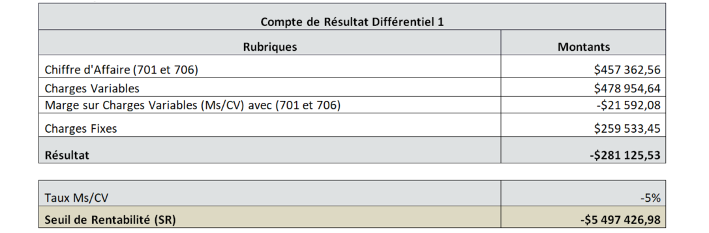
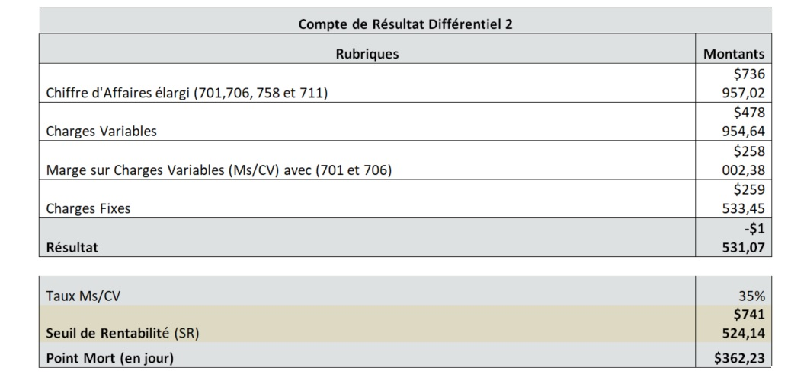

> [Accueil](../index) / [Seuil de rentabilité](./index) / Illustration du calcul de la détermination du seuil de rentabilité 

# Illustration du calcul de la détermination du seuil de rentabilité 

1.<strong><u> Détermination des Charges Fixes (CF) et Variables (CV)</u></strong>

2.<strong><u> Détermination du Revenu et Chiffre d'Affaire (CA) </u></strong>

3.<strong><u> Compte de Résultat Différentiel </u></strong>

