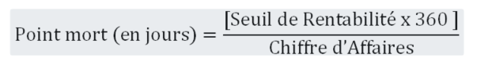

> [Accueil](../index) / [Seuil de rentabilité](./index) / Le calcul du point mort (PM)

# Le calcul du point mort (PM)

Le point mort (PM) est un indicateur complémentaire, calculé à partir du seuil de rentabilité, et qui permet de savoir à quel moment l’entreprise devient rentable, Le point mort est un indicateur exprimé en durée (jours, mois en année ou bien avec une autre valeur comme par exemple les nombres des malades ou bien autres valeurs) et calculé par la formule suivante :

