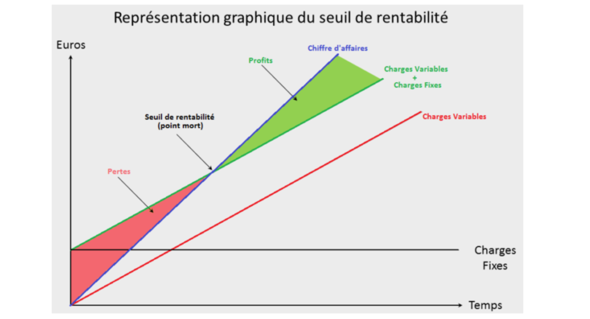

> [Accueil](../index) / [Seuil de rentabilité](./index) / Présentation

# Présentation

Si la notion de seuil de rentabilité ou de point mort est intéressante pour ces acteurs, leur mode de calcul est parfois délicat.

<strong>Qu’est-ce que le seuil de rentabilité, comment le calculer ? Qu’est-ce que le point mort ? Quelle différence y a-t-il entre le seuil de rentabilité et le point mort ?</strong>

Le seuil de rentabilité ou Break-even en anglais, correspond au montant de chiffre d’affaires minimum qu’une entreprise doit réaliser pour qu’elle puisse dégager de la rentabilité. C’est une notion essentielle dans le développement de l’entreprise puisqu’elle marque le moment à partir duquel elle devient rentable.

Le seuil de rentabilité est un indicateur important qui doit être mesuré lors de moments clés d’une entreprise :

- lors de la création de l’entreprise. Il fait partie des indicateurs qui apparaissent dans le prévisionnel financier qui est la partie chiffrée du business plan.
- lors d’opération spécifiques comme un lancement de produit, la mise en œuvre d’un projet, etc…

 Le seuil de rentabilité doit aussi être suivi régulièrement. <strong>Son évolution fournit des premières indications intéressantes sur le poids et l’équilibre des charges dans l’entreprise </strong>. C’est, avec d’autres indicateurs un premier niveau d’alerte en cas de dérapage des charges.
Enfin, le seuil de rentabilité peut avoir une utilité plus spécifique en étant mesuré pour une catégorie de produit, un projet défini, un établissement, … 

Le calcul du seuil de rentabilité ou du point mort nécessite de distinguer les charges selon qu’elles soient <strong>fixes</strong> ou <strong>variables</strong>. En effet, selon leur nature les charges évoluent différemment par rapport à l’activité de l’entreprise. Les charges dites variables évoluent avec le chiffre d’affaires alors que les charges fixes restent stables quel que soit le montant du chiffre d’affaires réalisé.

Or, le seuil de rentabilité correspond au chiffre d’affaires minimum nécessaire pour absorber l’ensemble des charges (fixes ou variables).

Le chiffre d’affaires atteint le seuil de rentabilité quand :
-	Le chiffre d’affaires annuel = charges variables + charges fixes
-	Total produit = totales charges

<u>Les charges fixes</u>

Les charges fixes n’évoluent pas en fonction de l’activité de l’entreprise. La plupart du temps elles sont liées au fonctionnement et à la structure de l’entreprise. Bien souvent elles sont payées avec une fréquence régulière le plus souvent mensuelle. On y trouve par exemple : 

-	Le loyer ;
-	Les assurances ;
-	La téléphonie ;
-	Les honoraires (prestations cabinet d’expertise comptable, etc.) ;
-	Les crédits baux, (loyer de crédit-bail) ;
-	La masse salariale hors partie variable (prime, salaires payés à l’heure, charges sociales …) ;
-	Les dotations aux amortissements d’immobilisations ;

<u>Les charges Variables et le seuil de rentabilité</u>

Les charges variables ce sont des charges dynamiques qui évoluent en fonction de l’activité de l’entreprise. Plus l’activité de l’entreprise n’est importante, plus le montant des charges variables augmentent.
On trouve par exemple :

-	Le coût de fabrication des biens ou des prestations fournies (il comprend notamment les coûts de matières premières, etc.) ;
-	L’achat de marchandises ;
-	La sous-traitance ;
-	La partie variable de la masse salariale (prime, saisonniers, etc.) ;

