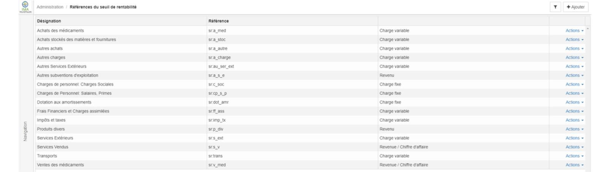
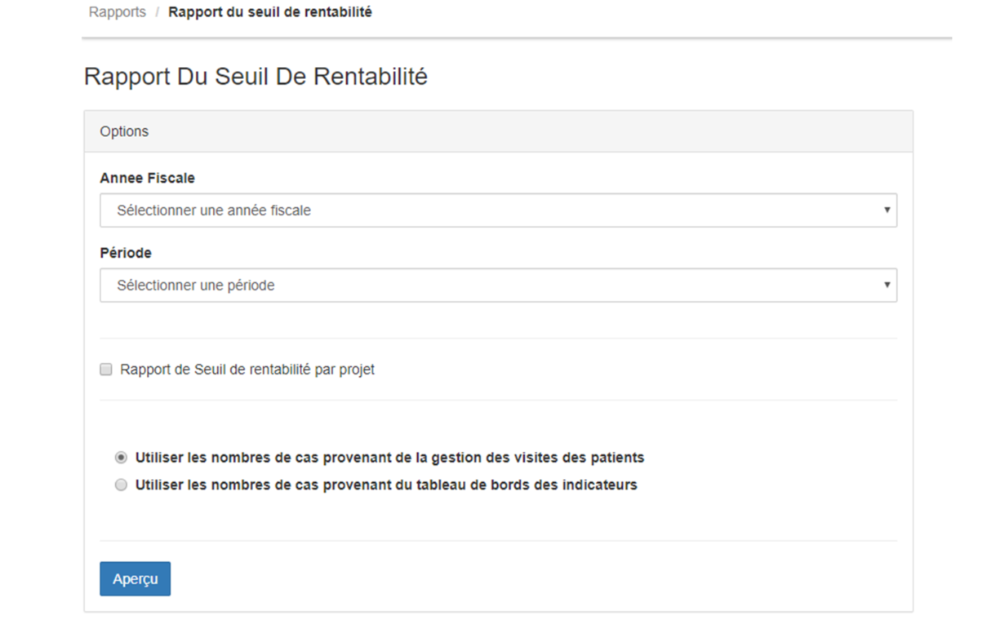

> [Accueil](../index) / [Seuil de rentabilité](./index) / Rapport du seuil de rentabilité

# Rapport du seuil de rentabilité 

L’interface d’accueil du rapport du seuil de rentabilité se présente de la manière suivante.

Il existe à l’extrême droit le bouton + Ajouter, qui permet d’ajouter une référence. Voici les éléments à fournir pour enregistrer une référence:

-   La désignation, 
-	La référence des comptes
-	Type (Charge ou bien revenue)
    - <strong>Charge</strong> : il faudra déterminer s’il s’agit d’une charge fixe ou bien d’une charge variable
    - <strong>Revenue</strong> : il faudra déterminer si la revenue fait partie du Chiffre d’affaire.

Pour visualiser le rapport de centre de frais, il faut sélectionner <strong>l’année fiscale, la période</strong>, il est aussi possible de visualiser le rapport de seuil de rentabilité par projet. Mais le rapport de seuil de rentabilité par projet n’est possible que s’il existe un lien entre les centres des frais principaux et les projets.

 
Dans le système Bhima, il est aussi possible de visualiser le rapport de seuil de rentabilité par nombre de cas, pour ce il y’a deux possibilité pour obtenir <strong>le nombre de cas d’hospitalisation, soit par le module de gestion des visites des patients soit via le tableau de bords des indicateurs</strong>.

