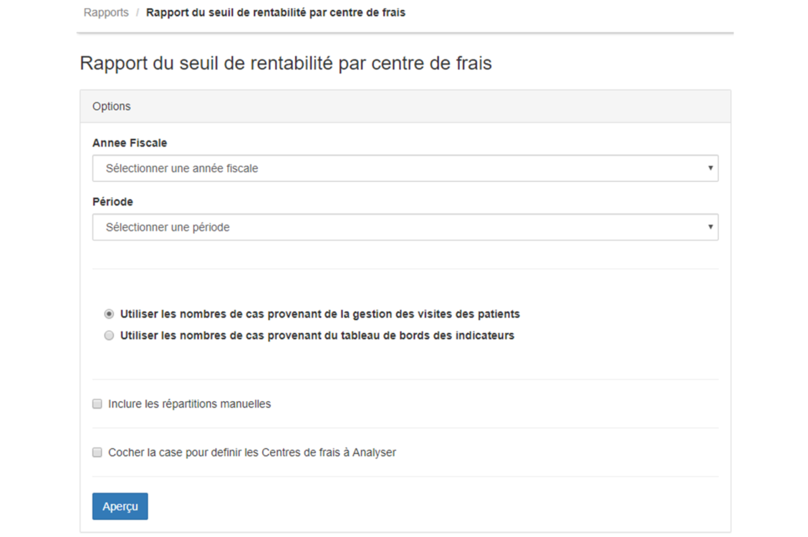

> [Accueil](../index) / [Seuil de rentabilité](./index) / Rapport du seuil de rentabilité par centres de frais

# Rapport du seuil de rentabilité par centres de frais

Le rapport du seuil de rentabilité par centres de frais est très similaire au précédant et son interface principale se présente de la manière suivante.

La case à cocher <strong>« Cocher  la case pour définir les centres de frais à analyser»</strong> permet de lister les centres principaux à analyser.

