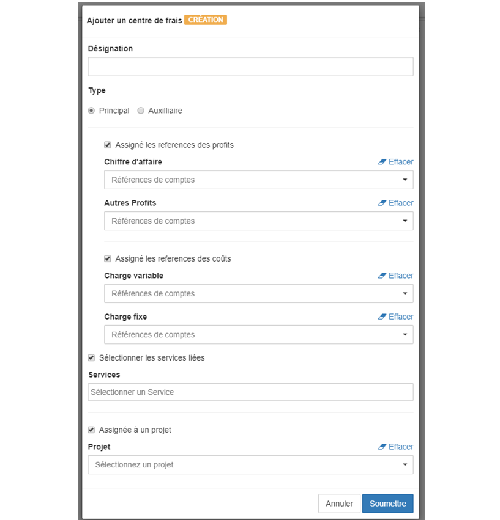

> [Accueil](../index) / [Centre des frais](./index) / Création des centres de frais

# Création des centres de frais

Dans la gestion des centres de frais, il existe deux catégories de centres qui sont :
-	Les centres principaux,
-	Les centres auxiliaires,

Les centres principaux sont ceux qui génèrent des profits mais aussi des coûts, les centres auxiliaires sont ceux qui fournissent des services ou prestations aux autres centres, les centres auxiliaires sont classifiés en centre de coût et centre de profit. 

L’interface principale permettant de la création des centres de frais se présente de la manière suivante.

Il existe à l’extrême droit le bouton <strong>+ Centres de frais</strong>, qui permet d’ajouter un centre de frais. 
Voici les éléments à fournir pour enregistrer un employé :
-	La désignation du centre, 
-	le type <strong>principal</strong> ou bien <strong>auxiliaire</strong> ainsi que l’assignation des références de comptes aux centres,
-	Une case à cocher qui permet de lier des services au centre,
-	Il existe aussi une case à cocher qui permet de lier les centres principaux à un projet,

Il existe deux catégories de références liées aux centres de coûts :
-	Charges variables,
-	Charges fixes,

Il existe aussi deux catégories de références liées aux centres de profits :
-	Chiffre d’affaire
-	Autres profits (par exemple les subventions, etc…)

