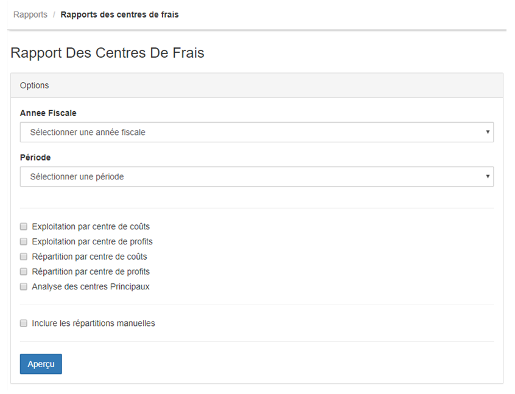
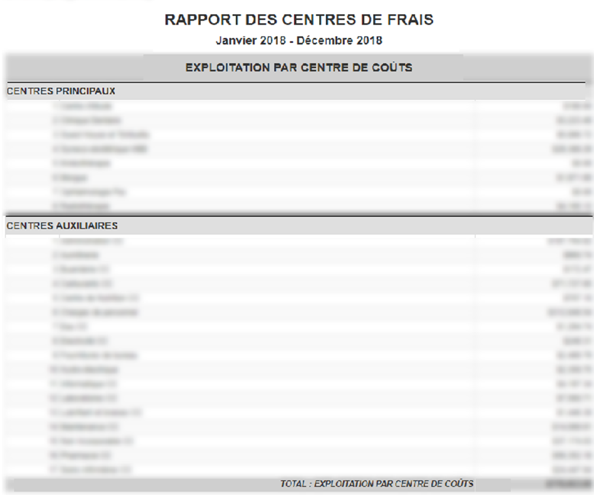
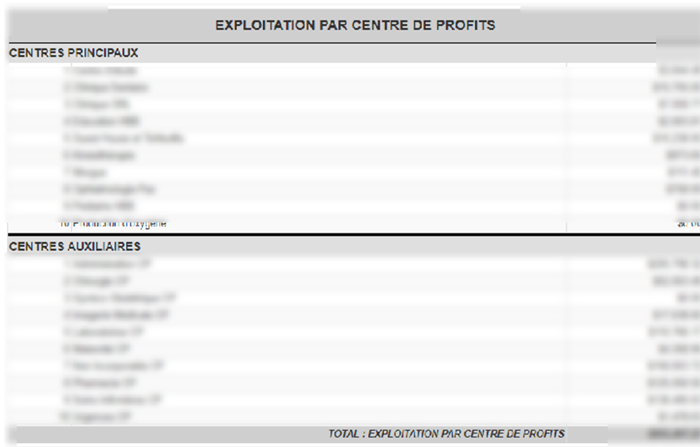

> [Accueil](../index) / [Centre des frais](./index) / Rapport des centres de frais

# Rapport des centres de frais

L’analyse des centres de frais intervient dans le contrôle de gestion de votre entreprise. Les coûts et profits encourus par l’entreprise doivent être transparents. Cette transparence permet de contrôler le résultat de domaines fonctionnels individuels et de fournir à la direction des informations importantes pour la prise de décision. Pour ce faire, tous les coûts et profits doivent être affectés en fonction de leur origine. 
L’interface d’accueil du rapport des centres de frais se présente de la manière suivante.

Pour visualiser le rapport de centre de frais, il faut sélectionner <strong>l’année fiscale</strong>, <strong>la période</strong>, parmi les options à cocher il y’a <strong>l’exploitation par centre de coûts</strong> et <strong>l’exploitation par centre de profits</strong>, qui permet d’afficher respectivement les coûts et profits générés directement par le centre de frais.

Les cases à cocher Répartition par <strong>centre de coûts</strong> et par <strong>centre de profits</strong>, permet d’afficher les répartitions des centres auxiliaires des coûts et profits vers le Centre Principaux, initialement la réparation est réalisée par rapport aux clés de répartitions. Mais il est aussi possible d’inclure les valeurs provenant de la répartition manuelle, pour ce il suffit de cocher la case <strong>inclure les répartitions manuelles</strong>.

Les cases à cocher répartition par <strong>centre de coûts</strong> et par <strong>centre de profits</strong> permet d’afficher un tableau croisé en vertical l’on retrouve les centres principaux, et en horizontal l’on retrouve les centres auxiliaires. 
 
Sur la deuxième colonne, l’on retrouve le <strong>coût</strong> ou bien le <strong>profit</strong> directement générer par les centres principaux, sur les cases résultant de l’intersection entre les centres principaux et auxiliaires l’on retrouve le montant résultant de la répartition d’un centre auxiliaire vers un centre principal.

La case à cocher <strong>Analyse des centres principaux</strong>  permet de visualiser pour chaque centre <strong>principal</strong> le total de <strong>coûts</strong> ainsi que le total de <strong>profits</strong>.

<em> Aperçu du rapport d’exploitation par centre de coûts </em>

<em> Aperçu du rapport d’exploitation par centre de profits </em>

