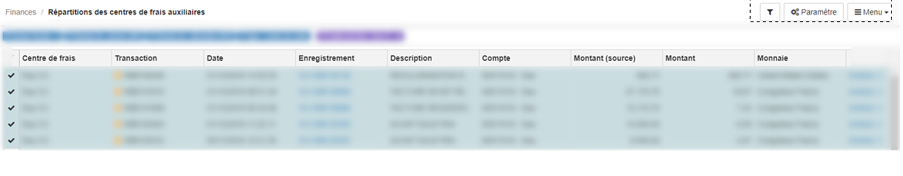

> [Accueil](../index) / [Centre des frais](./index) / Répartitions des centres de frais auxiliaires

# Répartitions des centres de frais auxiliaires

La répartition manuelle des centres de frais auxiliaires permet d’imputer directement les coûts ou bien les profits sans tenir comptes des clés de répartitions. 
Lorsqu’on accède à l’interface des répartitions pour la toute première fois, la fenêtre modale ci-après apparait.

Pour effectuer la répartition manuellement, il est nécessaire de sélectionner l’année fiscale, la plage des périodes, le centre de frais auxiliaires. Mais il est aussi possible de sélectionner le numéro de la transaction, le numéro de l’enregistre (Numéro de la facture, Numéro du bordereau), le compte, mais aussi le type du centre d’analyse (Centre de profit ou bien centre de coût).

<strong><u> Recherche des transactions </u></strong>

Pour rechercher les transactions liées à un centre de frais auxiliaire, il faut premièrement cliquer sur le bouton <strong>Paramètre</strong>, en suite:

1. Sélectionner l’année fiscale

2. Sélectionner la période

3. Sélectionner le centre auxiliaire

4. Sélectionner le type (Coût ou bien profit)

5. Après validation, toutes les lignes des transactions, correspondant aux conditions de filtrages vont s’affichaient sur la grille.

<strong><u> Répartitions par valeurs monétaire </u></strong>

Pour procéder à la répartition par valeur monétaire :
-	il faut premièrement sélectionner la ligne sur laquelle l’on veut faire la répartition,
-	Cliquer sur le bouton Actions et choisir l’option Répartir, cette action affichera une fenêtre,

La première partie de la fenêtre est renseigne sur le nom du <strong>centre auxiliaire</strong>, le montant à repartir, l’identifiant de la transaction, la date de la transaction, la description, le numéro de compte, sur la deuxième partie l’on retrouve l’ensemble <strong>des centres principaux</strong>, la répartition ne sera valide que si et seulement si l’ensemble du montant total a été repartis.

<strong><u> Ventilation par pourcentage </u></strong>

Pour procéder à la ventilation par pourcentage:
-	Il faut premièrement sélectionner l’ensemble des lignes dont on veut ventiler les produits ou bien les coûts.

-	En suite sélectionner dans le menu se trouvant à l’extrême gauche, 
-	Choisir l’option ventilation en pourcentage,

<strong><u> Ventilation automatique des factures </u></strong>

Lorsque l’on procède à la facturation dans le système BHIMA, l’on sélectionne naturellement le service, avec la gestion des centres de frais, il est possible faire la liaison entre plusieurs services à un centre principal.
La ventilation automatique des factures n’est possible que si et seulement si il existe une liaison entres les factures, les services liés aux factures et les centres principaux.

<em> Pour faire la ventilation automatique des factures, il faut nécessairement choisir le type centre de profit.</em>

-	Il faut premièrement filtrer les factures dans la grille, pour ce il faut cliquer sur le bouton <strong> filtre </strong>, 
-	Saisir le caractère <strong>IV</strong> qui est la codification pour <strong>Invoice</strong>, facture en français 

-	En suite sélectionner dans le menu se trouvant à l’extrême gauche, 
-	Choisir l’option ventilation automatique des factures,

<strong><u> Mis à jour de la répartition des centres de frais </u></strong>

Dans le système d’information Bhima, il existe un module qui permet de mettre à jour les répartitions effectuées des centres auxiliaires vers les centres principaux.
Lorsqu’on accède à l’interface des répartitions pour la toute première fois, la fenêtre modale ci-après apparait.

Pour effectuer la mise à jour d’une répartition, il est aussi nécessaire de sélectionner l’année fiscale, la plage des périodes, le centre de frais auxiliaires. Mais il est aussi possible de sélectionner le numéro de la transaction, le numéro de l’enregistre (Numéro de la facture, Numéro du bordereau), le compte, mais aussi le type du centre d’analyse (Centre de profit ou bien centre de coût).
Sur la grille des transactions réparties, les données répartis se présentent sous forme d’arborescence, et il est possible de voir la ventilation effectuée ainsi que les centres principaux concernés.

Pour procéder à la mise à jour d’une répartition effectuée, il faut premièrement rechercher cette la ligne de la transaction, ensuite cliquer sur le bouton Actions en suite choisir l’option Editer,

La fenêtre permettant de faire la mise à jour d’une répartition antérieure est très similaire à celle qui permettant de faire la répartition. <strong>La répartition ne sera valide que si et seulement si l’ensemble du montant total a été repartis</strong>.
