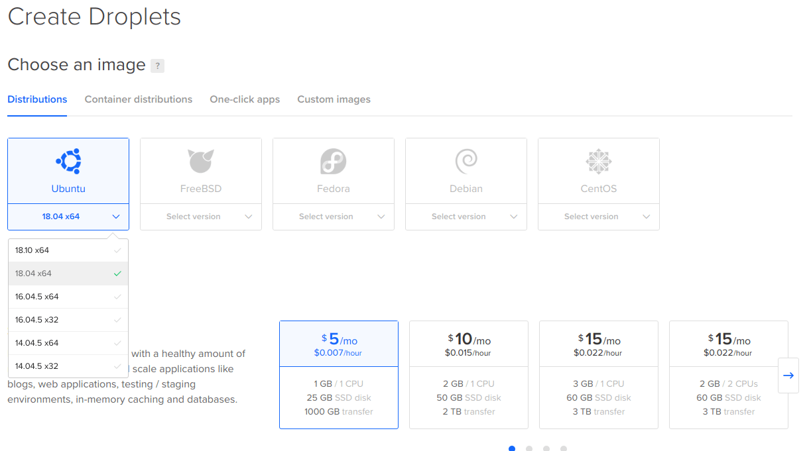
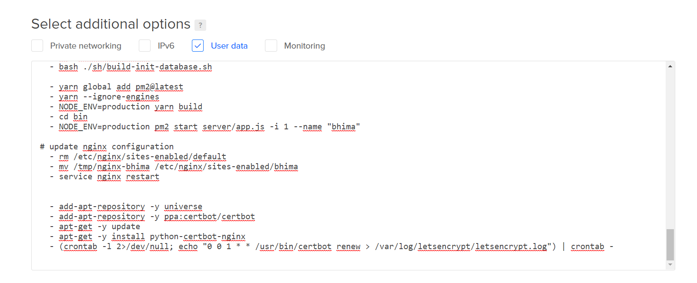

<style>
  .guilabel {
    border: 1px solid #7fbbe3 !important;
    background: #e7f2fa;
    font-size: 80%;
    font-weight: 700;
    border-radius: 4px;
    padding: 2.4px 6px;
    margin: auto 2px;
    color:#001;
    white-space: nowrap;
  }

  .left40 {
    margin-left:40px
  }
</style>


# Deploying BHIMA on DigitalOcean

<i> Suivez ces étapes ci-dessous posté à https://docs.opendatakit.org/aggregate-digital-ocean</i>

## Avertissement
<p>
Pour utiliser cette configuration, vous devez pouvoir lier un nom de domaine à l'adresse IP de la machine. Si vous ne possédez pas de domaine, des services tels que <a href='https://freedns.afraid.org/'>FreeDNS</a> offre des sous-domaines gratuits sous plusieurs domaines.
</p>

### Conseil
Si vous n'avez pas encore créé de compte DigitalOcean, utilisez notre lien de référence pour le faire : https://m.do.co/c/39937689124c.

DigitalOcean vous donnera 100 dollars de crédit à dépenser au cours des 60 premiers jours afin que vous puissiez faire des essais. Une fois que vous avez dépensé 25 $ avec eux, nous aurons 25 $ pour couvrir nos coûts d’hébergement.

# Créer votre Droplet

1. Connectez-vous à DigitalOcean et créez un nouveau Droplet.

2. Sélectionnez la distribution de votre nouveau Droplet: Sélectionnez l'option <span class='guilabel'>18.04.x x64</span> à partir de la boîte Ubuntu.



3.Sélectionnez une taille adaptée à votre utilisation prévue. Le <span class='guilabel'>Droplet Standard de 5$</span> devrait être suffisant pour une utilisation légère de Bhima. Si vous avez besoin de plus d’informations, DigitalOcean facilite le redimensionnement en gouttelettes plus grosses.

4. Si vous souhaitez des sauvegardes hebdomadaires automatiques, activez-les.

5. Vous n'aurez pas besoin de stockage en bloc.

6. Sélectionnez une région de centre de données physiquement proche de l'endroit où vous êtes.

7. Sous l'option <span class='guilabel'>Select additional</span>, cliquez la case à cocher <span class='guilabel'>User data</span>. Copier et coller le contenu du fichier : <a href='./cloud-init.yml'> Cloud-Config script</a>.




8. Dans la section Choisir un nom d’hôte (Select hostname), le nom de la machine en ligne sur DigitalOcean, entrez le nom de domaine (ex: votre.domaine). Ce nom d’hôte sera utilisé par le script Cloud-Config pour configurer la prise en charge HTTPS de votre serveur..

9. Vous n'aurez pas besoin d'ajouter de clés SSH publiques (sauf si vous savez ce que c'est et que vous voulez).

10. Cliquez sur le bouton Créer. Droplet prend quelques secondes, l'installation réelle de Bhima prend jusqu'à 10 minutes..

# Configurez votre domaine
## Conseil
<p>
Les Droplets de DigitalOcean utilisent des adresses IP qui peuvent changer si vous détruisez la machine. Pour vous assurer que votre installation Bhima sera toujours accessible en utilisant la même adresse IP, utilisez une adresse IP flottante en suivant ces instructions.
</p>

1. Une fois le Droplet est créé,copiez son adresse IP publique (ex: 12.34.56.78) et attribué un DNS qui pointe vers ce Droplet.
<ul class="left40">
 <li>
  Si vous possédez un domaine, consultez les instructions de votre registraire de domaine. Si vous ne possédez pas de domaine, nous vous recommandons d'utiliser<a href='https://freedns.afraid.org/'>FreeDNS</a>  pour obtenir un sous-domaine gratuit.
 </li>
 <li>
   Le paramètre TTL de votre domaine aura une incidence sur le temps qu'il vous faudra attendre pour pouvoir passer à l'étape suivante.
   Si votre fournisseur vous offre la possibilité de définir une durée de vie, utilisez la valeur la plus basse possible..
 </li>
</ul>

2. Ouvrez un navigateur Web et vérifiez périodiquement le domaine jusqu'à ce que vous voyiez le site Web BHIMA. Vous ne pourrez pas continuer l’installation tant que vous ne verrez pas le chargement du site Web.

# Autoriser le HTTPS

1. Dans le Panneau de configuration DigitalOcean, cliquez sur le nom de votre droplet, puis sélectionnez<span class='guilabel'>Access</span>sur le menu gauche. Clique le bouton <span class='guilabel'>Launch Console</span> pour ouvrir une session de console Web.
2. Lorsque la console s'ouvre, cliquez sur l'écran de la console et, à l'invite de connexion, entrez l'utilisateur: root. Votre mot de passe sera le mot de passe root que DigitalOcean vous a envoyé par courrier électronique..

<ul class="left40">
<li>
Si vous n'avez pas le mot de passe root, cliquez sur le nom de votre droplet, sélectionnez Accès dans la navigation de gauche, puis choisissez Réinitialiser le mot de passe root pour qu'un mot de passe vous soit envoyé par courrier électronique.
</li>
<li>
 Vous pouvez également vous connecter via SSH à l'aide de l'adresse ssh root@votre.domaine.
</li>
</ul>

3. Une fois connecté, exécutez la commande ``` sudo certbot run --nginx --non-interactive --agree-tos -m YOUR_EMAIL --redirect -d YOUR_DOMAIN.```

<ul class="left40">
<li>
Assurez-vous de remplacer YOUR_EMAIL et YOUR_DOMAIN par votre adresse électronique et votre domaine.
</li>
<li>
Lets Encrypt utilise l'adresse mail que vous avez fourni pour envoyer des notifications concernant l'expiration des certificats.
</li>
</ul>

# Lancez BHIMA sur le navigateur
1. Tapez https://votre.domaine et vérifiez si Bhima tourne.

2. Vous pouvez maintenant commencer à configurer vos informations d'interprise en cliquant sur le bouton <span class='guilabel'>installer</span>
