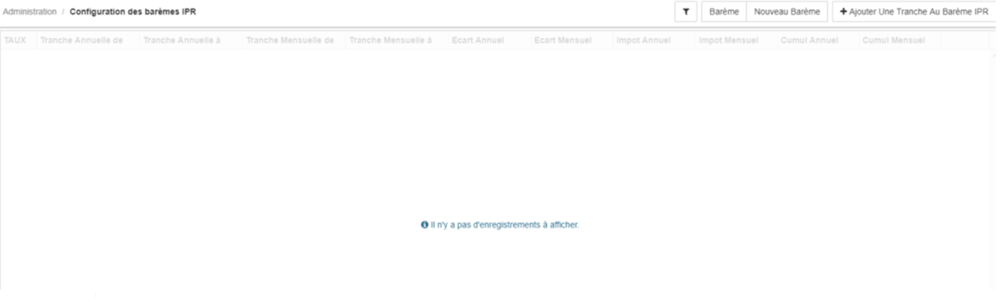

> [Accueil](../index) / [Ressources humaines](./index) / Configuration des barèmes IPR

# Configuration des barèmes IPR

Avec Bhima 2X, la configuration des barèmes IPR permet de gérer plusieurs barèmes à la fois, pour ajouter des  tranches à un barème il suffit de sélectionner le barème dans la liste de barème enregistré. 

Un clique sur barème permet d’affiché la liste des barèmes déjà enregistrés, une fois que le barème est choisi.

Voici les éléments à fournir pour enregistrer une tranche à un barème:
-	<strong>Taux,</strong>
-	<strong>Tranche Annuelle de,</strong>
-	<strong>Tranche Annuelle à</strong>,

Il est important d’enregistrer les tranches du plus petit taux vers le plus grand en ordre, mais aussi si la dernière tranche n’a pas des limites, il suffirait de l’estimer par rapport à la dernière classe la plus élevée du barème salariale. 

