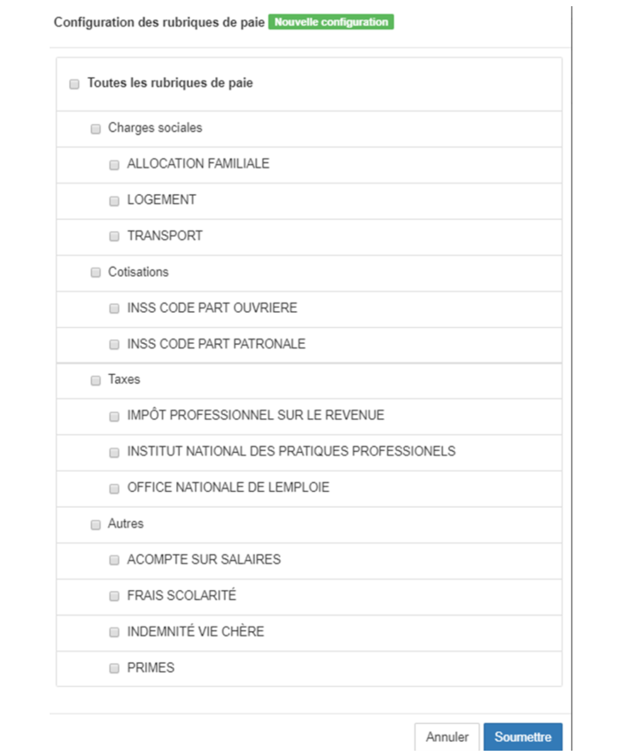

> [Accueil](../index) / [Ressources humaines](./index) / Configuration de la paie

# Configuration de la paie

La configuration de la paie est une étape très importantes, cette étape permette de pouvoir définir par exemple quelle seront les rubriques, les employés, la configuration des week-ends, qui seront utilisés durant une période de paie. 

<strong><u> Configuration des rubriques </u></strong>

Lorsque vous voulez créer une configuration des rubriques, 
-	il suffit de cliquer sur le bouton <strong>ajouté une configuration des rubriques</strong>,
-	nommé la configuration, une fois que la nouvelle configuration est créée, un clique sur le bouton action affiche un menu qui permet de mettre à jour le nom de la configuration mais aussi de sélectionner les rubriques de la dite configuration.

-	Le bouton <strong>configurer</strong>  permet d’afficher l’interface pour la sélection des rubriques, voici un aperçu de l’interface.

Les rubriques sont classés par catégories, il y’a les charges sociales (Avantages non imposables), les cotisations, les taxes ainsi que les autres rubriques, si l’on coche sur le case <strong>toutes les rubriques</strong> de paie, le système cochera automatiquement l’ensemble des rubriques de paie, mais aussi s’il l’on coche les entêtes de chaque catégorie, ça sera l’ensemble des éléments de cette catégorie qui seront sélectionnés

<strong><u> Configuration des comptes </u></strong>

Le module configuration des comptes permet de définir le compte des charges utilisé par l’entreprise pour la rémunération du personnel.

<strong><u> Configuration des weekends </u></strong>

La configuration des weekends permet de sélectionnez parmi les journées ceux qui sont considéré comme ouvrable, c’est opération permettra de comptabilisé le nombre des jours ouvrables pour une période de paie.

- Lorsque vous voulez créer une configuration des weekends, 
    - il suffit de cliquer sur le bouton ajouté une configuration des weekends,
    - nommé la configuration, une fois que la nouvelle configuration est créée, un clique sur le bouton action affiche un menu qui permet de mettre à jour le nom de la configuration mais aussi de sélectionner les jours ouvrable de la dite configuration.

<strong><u> Configuration des employés </u></strong>

La configuration des employés permet de sélectionner les employés qui figureront sur la liste de paie.

- Lorsque vous voulez créer une configuration des employés, 
    -	il suffit de cliquer sur le bouton <strong>ajouté une configuration des employés,
    -	nommé la configuration, une fois que la nouvelle configuration est créée, un clique sur le bouton action affiche un menu qui permet de mettre à jour le nom de la configuration mais aussi de sélectionner les employés.

Si l’on clique sur la case à coché Tous les employés, <strong>tous les employés</strong> seront sélectionnés à l’exception de ceux qui sont bloqués. 

<strong><u> Configuration des périodes </u></strong>

La configuration des périodes de paiement permet de définir la date du début et celle de la fin de la période, la configuration des employés, des rubriques, des comptes, des weekends ainsi que celui de la taxe IPR (la taxe IPR est calculé en fonction de la loi de finances de République Démocratique du Congo).

Les responsables des ressources humaines devra veuillez à ce que les différentes configurations puissent reflétez la situation réel de l’entreprise. 

-	Il est fortement déconseillé de modifié une configuration qui a déjà était utilisé pour une période antérieure,
-	Pour toute modification des éléments d’une configuration que ça soit l’ajout ou bien le retrait d’un élément d’une des configurations que ce soit les rubriques, les employés, les comptes ou bien les weekends doit nécessité la création d’une nouvelle configuration.

<strong><u> Gestions des vacances </u></strong>

Le module des gestions des vacances permet d’enregistrer les vacances des employés. Le formulaire d’enregistrement permet de définir la période des vacances, le pourcentage de paiement ainsi que la désignation de la vacance. 
Voici les éléments à fournir pour définir la période de vacance d’un employé :

- <strong>Nom de l'employé</strong>: le nom complet de l’employé.
- <strong>Désignation</strong> : motif ou bien raison.
- <strong>La période</strong> : date du début ainsi que la date de la fin au format (jj/mm/aaaa)
- <strong>Le pourcentage</strong> : par rapport au taux de paiement journalier

