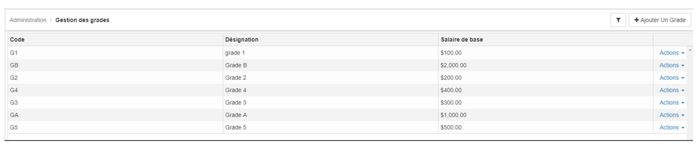

> [Accueil](../index) / [Ressources humaines](./index) / Gestion des grades

# Gestion des grades

Le module des gestions des grades permet d’enregistrer les grades des employés. Le formulaire d’enregistrement permet d’obtenir des informations nécessaires pour le calcul des salaires des employés. 
Voici les éléments à fournir pour enregistrer un grade :

- <strong>Désignation</strong>, 
- <strong>Code</strong>,
- <strong>Le salaire de base</strong> : le salaire de base est défini par rapport à la monnaie principale de l’entreprise.

