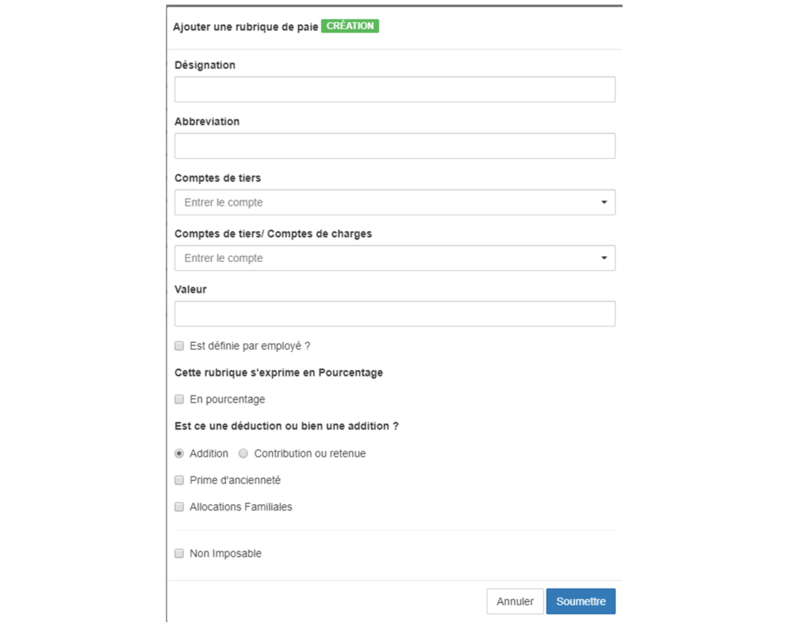

> [Accueil](../index) / [Ressources humaines](./index) / Gestion des rubriques de paie

# Gestion des rubriques de paie

Le module gestion des rubriques de paie permet de créer des rubriques, les rubriques constituent les différents éléments qui doivent figurer sur le bulletin de paie.

Les rubriques figurant sur le bulletin de paie se catégorisent en avantages et contribution ou retenue.

Les avantages sont subdivisés en deux catégorie ceux qui sont imposables et ceux qui sont non imposables. 

Les contributions sont des rubriques qui sont obligatoire soit au niveau de l’entreprise ou bien au niveau du Pays. 

Le formulaire permettant d’enregistrer les rubriques de paie se présente de la manière suivante.

- <strong> Désignation </strong>: est la dénomination de la rubrique
- <strong> Abréviation </strong>: est la codification de la rubrique
- <strong> Le Compte de tiers </strong>: le compte de tiers est le compte par lequel l’entreprise comptabilise les opérations concernant l’entreprise vers le tiers,
    - s’il s’agit d’un avantage à l’employé l’on sélectionnera un compte de tiers lié à la rémunération des personnels 
    - s’il s’agit d’une contribution ou retenue l’on sélectionnera un compte de tiers liés à cette contribution ou retenue 

- <strong> Le compte de tiers / Comptes de charges </strong> : permet de sélectionner le compte qui prend en charge la rubrique,
    - s’il s’agit d’un avantage de l’employé l’on sélectionnera un compte de charge liée à cet avantage.
    - s’il s’agit d’une contribution ou d’une retenue prise en charge par l’employé l’on sélectionnera le compte de tiers lié à la rémunération des personnels.

    - s’il s’agit d’une contribution pris en charge exclusivement par l’entreprise l’on sélectionnera un compte de charge.

- <strong>La valeur</strong> : permet de définir une valeur monétaire par défaut par rapport à la monnaie de l’entreprise mais si l’on coche Cette rubrique s'exprime en Pourcentage, la rubrique à créer se calculera en pourcentage par rapport à la somme du salaire de base plus l’ensemble des taxes imposables.

- <strong>Est définie par employés</strong> : il existe une possibilité de définir la valeur monétaire d’une rubrique pour chaque employé. Si l’on coche cette case, la rubrique créée apparaitra désormais sur le formulaire d’enregistrement des employés.

- <strong>Est-ce une déduction ou bien une addition </strong>:
    - <strong>Pour les additions (Avantages) </strong>: il faudrait spécifier si la rubrique à créer est <strong>l’ancienneté</strong> ou bien <strong>l’allocation familiale</strong>, l’ancienneté se calcul en multipliant <strong>le salaire de base</strong> par le <strong>taux</strong> par le nombre d’année de service, l’allocation familiale se calcul en <strong>multipliant le  nombre des personnes à charges</strong> par <strong>le taux</strong>. La case à cocher Non imposable permet de distinguer les rubriques imposables des rubriques imposables.

- <strong>Pour les déductions ou retenus</strong> : il faudrait spécifier si la rubrique est une cotisation en effet le système de paie de la république démocratique du Congo, le calcul de l’impôt professionnel sur rémunérations nécessite au préalable la déduction de la cotisation de la Caisse Nationale de sécurité Sociale (CNSS ancien INSS) quotte part ouvrière du salaire brute imposable. Raison pour laquelle dans le système Bhima il y’a lieu de distinguer les taxes des cotisations. Si la rubrique n’est pas une cotisation alors il faudrait spécifier si c’est une taxe ou une retenue, si la rubrique à créer est une taxe il y’a une case à cocher qui demande si la nouvelle rubrique est l’IPR en effet l’IPR est calculé automatiquement dans le système Bhima mais si cette retenus n’est pas une taxe il faudrait spécifier si cette rubrique sera <strong> associé à l'identifiant de l'employé</strong>, cette assignation est nécessaire pour les rubriques telles que les avances sur salaires, les acomptes sur salaires ou bien autre prise en charge en vue de d’affecté l’identifiant de l’employé sur la ligne de la transaction des écritures comptables.

les déductions et les retenues doivent être prise en charge soit par l’employeur soit par les employés.

