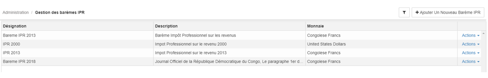
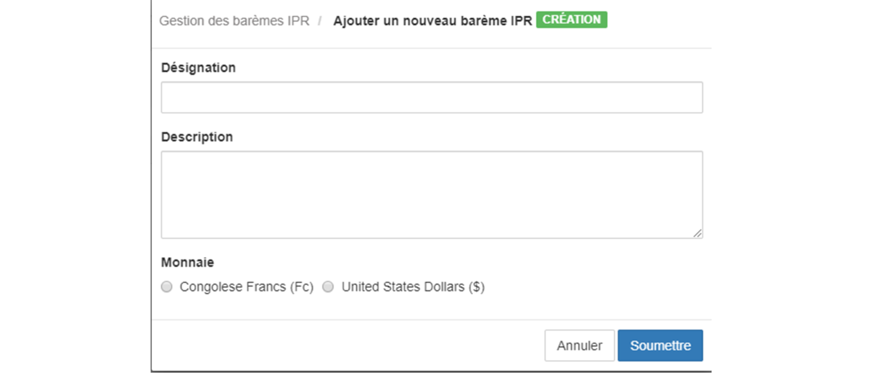

> [Accueil](../index) / [Ressources humaines](./index) / Gestion de la taxe IPR

# Gestion de la taxe IPR

Le module Payroll du système BHIMA, permet de calculer automatiquement la taxe IPR (Impôt Professionnel sur rémunérations) par rapport à la République Démocratique du Congo, l’interface principale de ce module se présente de la manière suivante.

Le bouton ajouter un nouveau barème IPR permet de lancer le formulaire d’enregistrement d’un nouveau barème IPR, le formulaire d’enregistrement se présente de la manière suivante.

- <strong>Désignation</strong>: est la dénomination du nouveau barème
- <strong>Description</strong>,
- <strong>Monnaie</strong> : c’est la devise par laquelle les différentes tranches du barème seraient enregistrées.
