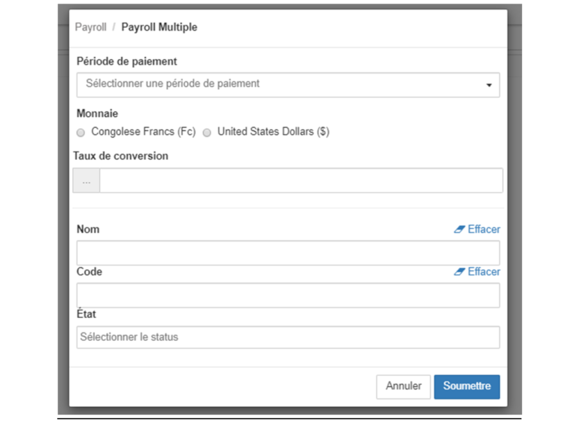
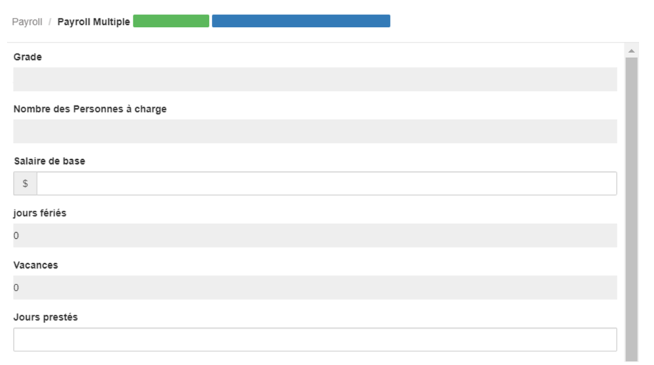
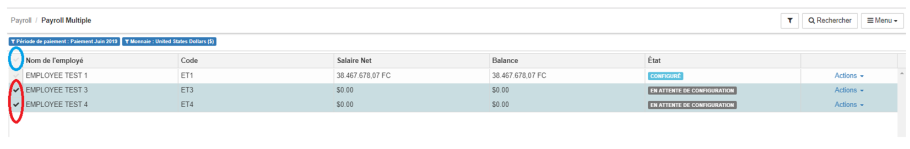
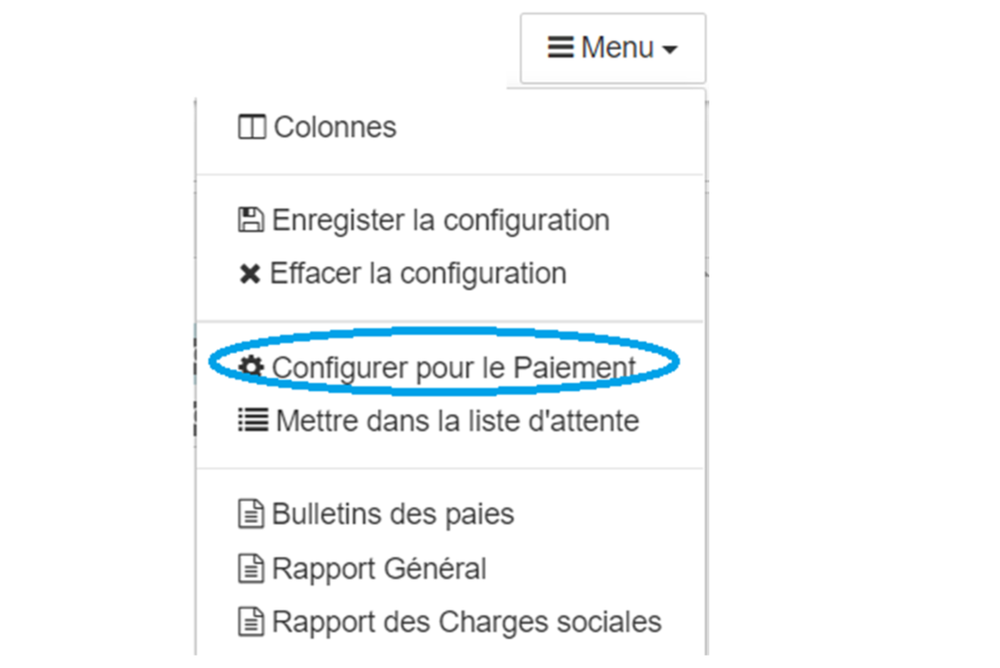
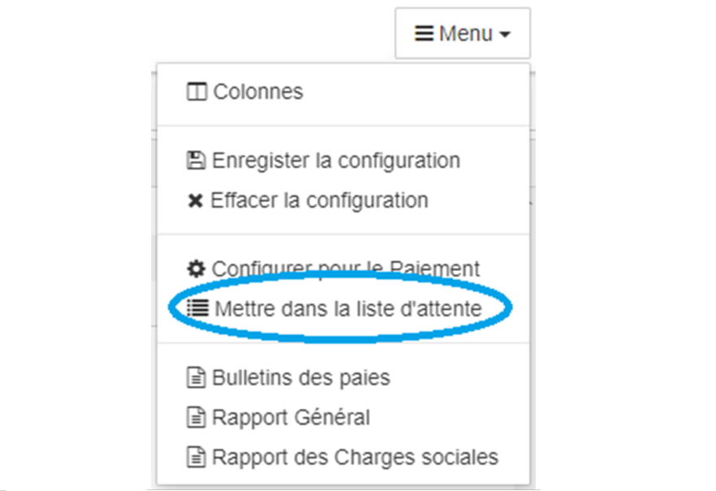

> [Accueil](../index) / [Ressources humaines](./index) / Payroll multiple

# Payroll multiple

Le module de Payroll Multiple est basé sur les différentes configurations détaillé sur le point VIII, ce module vous aide à configurer et à lancer automatiquement les écritures comptables liées à la paie des employés, notamment :

-	Les engagements des salaires,
-	Les retenus des employés,
-	Ainsi que les charges sociales sur rémunération,

La première fois que l’utilisateur accède au module Payroll Multiple, une fenêtre modal apparait et invite ce dernier de pouvoir sélectionner une période de paiement,

1.<strong><u> Les détails des éléments du formulaire</u></strong>

Voici les éléments à fournir pour enregistrer un employé :
-	<strong>Période de paiement </strong>: permet de sélectionner la période de paie.
-	<strong>Monnaie </strong>: la monnaie à sélectionner permet de spécifier la devise à considérer pour la visualisation des bulletins de paie, ainsi que les autres rapports. NB. Il est impossible de configurer le paiement d’un employé dans une monnaie autre que la monnaie de l’entreprise.
-	<strong>Le taux de conversion </strong> : permet de fixé le taux de change pour la visualisation des différents documents dans une monnaie autre que la monnaie principale de l’entreprise.

La deuxième partie de cette fenêtre permet de filtrer les employés figurant dans la configuration des employés associés à la période de paiement.
-	Nom : permet de filtrer les employés par les initiales de leurs noms
-	Code : permet de filtrer les employés par rapport à leurs codes ou bien le numéro matricule.
-	L’état : permet de filtrer les employés par rapport à leurs statuts.
    - En attente de configuration : c’est le statut par défaut des employés qui ne sont pas encore configuré pour le paiement.
    - Configuré : le statut configuré signifie que le responsable des ressources humaines à insérer les données liées à l’employé par rapport au calcul du salaire.
    - En attente de paiement : signifie que le Comptable a déjà lancé le processus de passation automatique des écritures d’engagements, des retenues sur salaire ainsi que les charges sociales sur rémunérations mais que l’employé n’est pas encore paie.
    - Payé : Signifie que l’employé a touché l’intégralité de son salaire.
    - Payé partiellement : Signifie que l’employé avait été payé partiellement.

2.<strong><u> Configuration des employés pour le paiement</u></strong>

La configuration des employés pour le paiement permet d’enregistré les informations devant figuré sur le bulletin de paie de l’employé. 
Avec le système Bhima 2X, il existe deux façons pour effectuer cette opération, la procédure manuelle et la procédure automatique.

La configuration d’un employé pour le paiement n’est pas une opération irréversible

<strong><u><i>2.1. La procédure manuelle</i></u></strong>

Pour faire la configuration d’un employé manuellement, cliquez sur le bouton Action se trouvant sur la même ligne que le nom de l’employé, et suite sur configuré.

L’interface principale pour la configuration manuelle se présente de la manière suivante.

-	<strong>Grade</strong> : le grade de l’employé.
-	<strong>Nombre des personnes à charges</strong>.
-	<strong>Le salaire de base</strong> : C’est le salaire de base de l’employé, notons que ce salaire de base peut aussi être celui qui est assigné à son grade ou bien qui lui est assigné individuellement, les jours fériés renseignes sur le nombre des jours fériés qu’il y’a eu durant la période de paie.
-	<strong>Vacances</strong> : c’est le nombre de nombre de jours que l’employé a était en vacances durant la période de paie.
-	<strong>Jours prestés</strong> : cette valeurs est égale à la somme des jours ouvrables de la période, et le responsable de la paie ne le modifiera que si le nombre de jour des prestations de l’employé est inférieur à cette valeur, notons aussi que cette valeur est réduit lorsque l’employé a été en vacance durant la période de paie.

s’expriment en pourcentage, ou bien que les valeurs ne sont pas calculées automatiquement. Il est recommandé de fournir toutes les valeurs sinon il faut écrire zéro.
Pour les rubriques dont les valeurs sont définies par employés, la valeur définies apparaitre comme valeur par défaut pour l’employés.
 

<strong><u><i>2.2. La procédure automatique </i></u></strong>

Pour faire la configuration automatique il faut premièrement sélectionner l’employé ou bien les employés qui doivent être configuré automatique.

Il est possible de sélectionner les employés individuellement en cochant

se trouvant juste sur la première colonne de la grille. La case encerclée en bleu permet de sélectionner l’ensemble des employés de la liste.

Une fois que la sélection est terminée le bouton Menu possède dans sa liste l’option, Configurer pour le paiement. 

Pour la configuration automatique, seule les rubriques qui s’expriment en pourcentage, calculées automatiquement, ou bien ceux dont les valeurs sont définies par employés seront prises en compte. La configuration automatique ne concerne que les employés qui sont en attente de configuration. 

<strong><u><i>2.3. Mettre les employés dans la liste d’attente de paiement </i></u></strong>

Pour mettre les employés dans la liste d’attente du paiement,  il faut premièrement sélectionner l’employé ou bien les employés qui doivent au préalable être configuré. 
Une fois que la sélection est terminée le bouton Menu possède dans sa liste l’option, Mettre dans la liste d’attente.

La mise en attente dans la liste d’attente est une opération irréversible, et les transactions issues de cette opération sont enregistrées dans le journal de saisie à la date de la fin de la période de paie. 

<strong><u><i>2.4. Rapport </i></u></strong>

Il est possible de pouvoir visualiser le bulletin de paie ainsi que d’autre rapport synthétique sur la situation de paie. Pour visualiser le bulletin de paie d’un employé, il suffit de cliquer dans la zone action

Il est aussi possible de pouvoir les bulletins des paies de un ou bien plusieurs employés à la fois. Pour ce il suffit tout d’abord de les sélectionner en suite sur le <strong>Menu</strong>, choisir l’option <strong>Bulletins des paies</strong>.

-	L’option Rapport Général affiche les éléments du bulletin de paie sous forme d’un tableau.
-	L’option Rapport des charges sociales affiche sous forme d’un tableau, l’ensemble des rubriques qui sont prises en charges par l’institution. 
