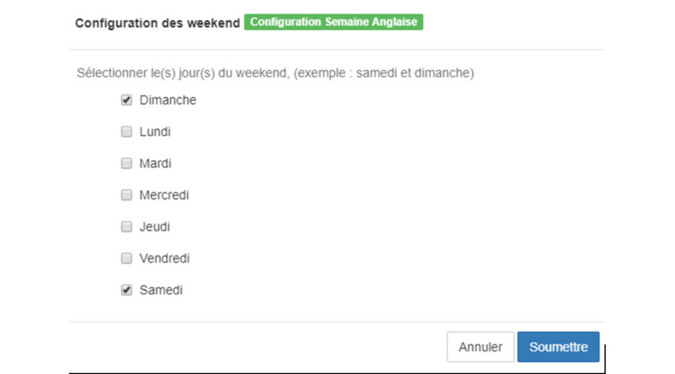

> [Accueil](../index) / [Ressources humaines](./index) / Pratiques

# Pratiques

1.<strong><u> Bulletin de paie de la France </u></strong>

Cette première pratique consistera à Analyser le bulletin de paie d’une entreprise de la République Française dans le but de le configurer dans le système BHIMA.

<strong><u><em> Etape 1. Identification des rubriques </em></u></strong>

En visualisant ce bulletin de paie voici les rubriques que nous avons décelé

- <strong>Heures supplémentaires</strong> : cette rubrique sera créée dans Bhima et sera classifié comme addition ou avantage imposable.
- <strong>Heures supplémentaires ou majorées</strong> : cette rubrique sera créée dans Bhima et sera classifié comme addition ou avantage imposable.
- <strong>Accueil Occasionnel</strong> : cette rubrique sera créée dans Bhima et sera classifié comme addition ou avantage imposable.
- <strong>Absences</strong> : cette rubrique devrait être classifié comme retenue, mais dans le système Bhima le nombre d’absence doit être traduit en jour et devrait être déduit du nombre de jour de prestation.
- <strong>Congés payés</strong> : cette rubrique sera créée dans Bhima et sera classifié comme addition ou avantage.
- <strong>Divers</strong> : cette rubrique sera créée dans Bhima et sera classifié comme <strong>addition</strong> ou <strong>avantage</strong>.

Dans le système BHIMA, nous n’assigneront la propriété <strong>cotisation</strong> qu’à la CNSS ancien INSS en vigueur  à la République Démocratique du Congo, en ce qui concerne les cotisations existant dans d’autre pays, nous allons le considéré tout simplement comme étant des <strong>taxes</strong>. 

- <strong>CSG non imposable</strong> : cette rubrique sera classifiée comme étant une taxe prise en charge par les employés.
- <strong>CSG+CRDS imposable</strong>: cette rubrique sera classifiée comme étant une taxe prise en charge par les employés.
- <strong>Sécurité Sociale</strong> (maladie, vieillesse, veuvage): cette rubrique sera classifiée comme étant une taxe prise en charge par les employés.
- <strong>Prévoyance</strong> : cette rubrique sera classifiée comme étant une taxe prise en charge par les employés.
- <strong>Retraite complémentaire</strong> : cette rubrique sera classifiée comme étant une taxe prise en charge par les employés.
- <strong>Assurance chômage</strong> : cette rubrique sera classifiée comme étant une taxe prise en charge par les employés.
- <strong>AGFF</strong> : cette rubrique sera classifiée comme étant une taxe prise en charge par les employés.

<strong><u><em> Création des rubriques dans Bhima </em></u></strong>

Voici un aperçu de la création de la rubrique Heure Supplémentaires, le compte de tiers sera le compte liées aux salaires des employés, le compte de tiers ou compte de charges sera le compte par laquelle l’entreprise supporte la charge <strong>Heures Supplémentaires</strong>.

<em> NB. Les rubriques suivantes :</em>
-	Heures supplémentaires ou majorées, 
-	Accueil Occasionnel, 
-	Congés payés,
-	Divers.

Vont être créé de la même façon que la rubrique Heures supplémentaires car, tous ses rubriques sont des additions ou avantages et tous sont Imposable raison pour laquelle 
<strong>Attention</strong>. Sur ce bulletin de paie il existe une rubrique «absences », cette rubrique réduit le total du salaire brut, or le système BHIMA calcul le salaire de base en multipliant le taux journalier (Salaire de Base divisé par le nombre de jours ouvrables de la période de paie) par le nombre des jours de prestations Or sur ce bulletin, le salaire de base est défini par heures, donc pendant la configuration nous allons définir une période de paie de 22 jours tout en supposant que le nombre d’heure de travail est de 8 heures, du faite que cette employée a eu 8 heures cela reviendrai à dire que ce dernier a eu 1 jour d’absence ce qui reviendrai à dire qu’il n’a travaillé que pendant 21 jours. Le salaire de base de cet employé sera initialisé à 3 520€, le taux journalier dans sera (3 520€ / 22 = 160€).
 

-	En ce qui concerne les taxes nous avions analysé les taxes suivantes <strong>CSG non imposable et CSG+CRDS imposable</strong>, ces deux taxes bien que se calculant en pourcentage respectivement 6.8% et 2.9% par rapport au salaire bruts imposable, la valeur du salaire brut est diminuer de 1,75% ou soit multiplier par 98.25% cette diminution fera en sorte que le pourcentage de la rubrique CSG non imposable deviendra (6.8% x 98.25% = 6.68%) et celui de CSG+CRDS imposable (2.9% x 98.25% = 2.84%),

-	pour les autres taxes leur création dans le système Bhima se fera avec les pourcentages qui sont mentionnés sur le bulletin de paie.

Voici un aperçu des différents modules créée avec le système Bhima.

<strong><u><em> Etape 3. Création de la configuration des rubriques </em></u></strong>

Pour la création des rubriques nous crée une configuration que nous avions appelé <strong>rubriques Frances</strong>.

<strong><u><em> Etape 4. Création de la configuration des comptes</em></u></strong>
Voici un aperçu de la configuration de compte pour la rémunération du personnel.

<strong><u><em> Etape 5. Création de la configuration des weekends </em></u></strong>

Pour la configuration des weekends, l’utilisateur doit définir seulement les jours de la semaine qui ne sont pas considérée comme jour ouvrable.

<strong><u><em> Etape 6. Configuration des périodes</em></u></strong>

Pour la configuration des périodes, nous allons créer une période de paie de 22 jours, qui commencera du 30 mai 2019 au 30 Juin 2019, nous allons sélectionner les configurations que nous avions créées.

<strong><u><em> Etape 7. Payroll Multiple </em></u></strong>

Nous allons faire la configuration manuelle du paiement d’un employé conformément avec notre bulletin de paie, voici la procédure :

- Recherchez la période de paie.

- Sélectionnez un employé, cliquez sur le bouton action, cliquez sur l’option configurer

- Remplissez le formulaire de configuration.

Voici un aperçu du bulletin de paie ainsi que le rapport générale générer par le système BHIMA.

2.<strong><u> Bulletin de paie de la RD CONGO </u></strong>

Veuillez créer les configurations nécessaires pour que le système BHIMA puisse générer le bulletin de paie suivant.

Pour réussir cet exercice il faut utiliser et configurer le barème IPR de 2012 de la République Démocratique du Congo.

