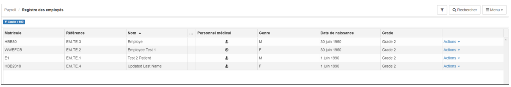

> [Accueil](../index) / [Ressources humaines](./index) / Registre des employés

# Registre des employés

Avec Bhima 2X, nous avons amélioré la manière dont  la grille se présente. Vous pouvez désormais rechercher, modifier, télécharger la liste des employés,

- permet de filtrer les éléments de la grille par rapport aux colonnes de la grille. 

- permet de rechercher les employés par rapport à certaines informations.

- le menu donne la possibilité de reconfigurer les colonnes de la grille, ainsi que celle de télécharger la liste des employés en Excel et en PDF.

- Sur chaque ligne de la grille, il existe un bouton action qui permet de modifier les données d’un employé, de le bloquer (Un employé bloqué est un employé qui est soit retraité, décédé ou bien qui ne travaille plus pour l’entreprise).
