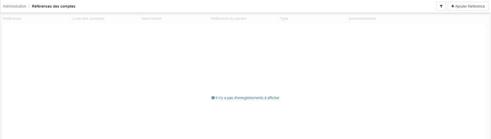
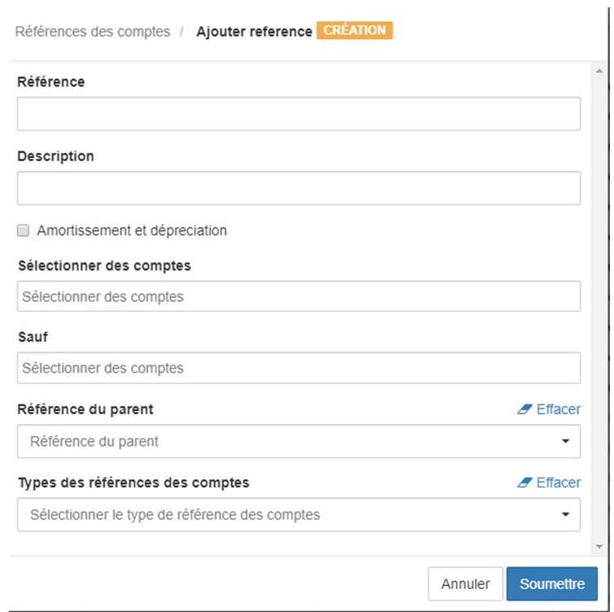

> [Accueil](../index) / [Références des Comptes](./index) / L’interface principale

# L’interface principale

L'interface du module de références des comptes possède une grille liste l’ensemble des références créées.

L’interface du module d’administration des références des comptes possède à l’extrême gauche, un filtre pour rechercher une référence, ainsi que le bouton Ajouter Référence.

Voici les éléments à fournir pour enregistrer une référence de compte :

-	La Référence : est une codification qui permet d’identifier la référence.
-	La Description : est un texte qui permet de décrire la référence de compte.
-	Amortissement et dépréciation : est une case à cocher qui d’identifier une référence de compte comme Amortissement et dépréciation, cette notion est très important lors de la création des références des comptes pour le Bilan.
-	Sélectionner des comptes : permet de sélectionner les comptes qui vont faire partie de la référence.  Lorsqu’on  choisit un compte parent, lors que l’on choisit un compte parent, tous ses enfants font automatiquement partie de la référence.
-	Sauf : permet de sélectionner les comptes à ignorés dans une référence de compte, généralement les comptes à ignorés doivent être des comptes dont le parent se retrouve parmi les comptes sélectionnés.
-	Référence du parent : permet de sélectionner la référence parent.
-	Types des références des comptes : la notion de type des références des comptes permet de regrouper dans une même catégorie plusieurs références des comptes, par défaut dans le système Bhima il existe quatre type de références par défaut le Bilan,  le compte des résultats, le Centre des frais, le seuil de rentabilité. Il existe un module qui permet d’ajouter d’autre type de références.

L’interface du module d’administration des références des comptes possède à l’extrême gauche, un filtre pour rechercher une référence, ainsi que le bouton Ajouter Référence.

