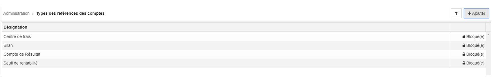
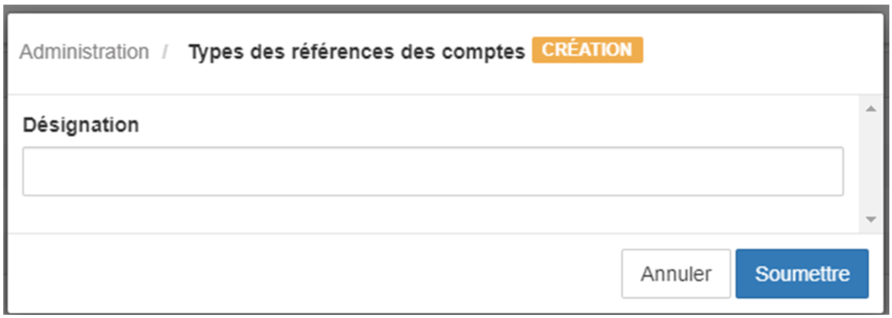

> [Accueil](../index) / [Références des Comptes](./index) / Types des références des comptes

# Types des références des comptes

Le concept types des références des comptes est un moyen qui permet de catégoriser les références des comptes, cette catégorisation est très lorsque l’on désire faire des analyses avec le rapport de valeur des références des comptes. 
L'interface du module type des références des comptes est accessible via le nœud <strong>Administration.</strong> 

Voici un aperçu de la grille avec le type des références des comptes prédéfinis, pour ajouter un nouveau type de référence de compte, il suffit de cliquer sur le bouton <strong>+Ajouter.</strong>

