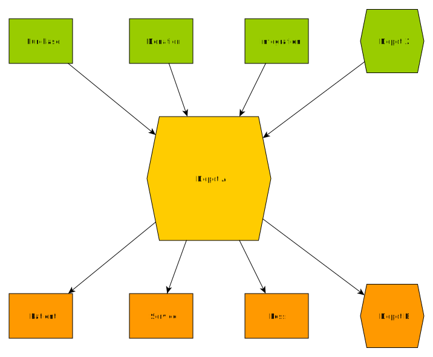

> [Accueil](../../index.md) / [Gestion des stocks](../index.md) / les mouvements des stocks

# les mouvements des stocks

Grâce à BHIMA il est possible d'effectuer les mouvements de stock tels que :
- [Les entrées des stocks](./entry.md)
    - En provenance d'un achat
    - En provenance d'une intégration
    - En provenance d'une donation
    - En provenance d'un autre dépôt
- [Les sorties des stocks](./exit.md)
    - A destination d'un patient
    - A destination d'un service
    - A destination d'un autre dépot
    - Comme perte de stock
- [Les ajustements des stocks](./adjustment.md) : lorsque les quantités physiques diffèrent des quantités dans BHIMA, il est possible d'ajuster soit positivement, soit négativement la quantité des stocks concernés.

Touts ces mouvements sont enregistrés dans le registre des mouvements de stock, ce qui permet de les consulter à tout moment si besoin se présente.

  <h4>Pré-requis</h4>
  <strong>Dépot</strong>: les opérations de stock nécessite un ou plusieurs dépots, d'où si aucun dépot n'est défini, le système vous suggerera de choisir un dépot ou d'en créer un nouveau.

