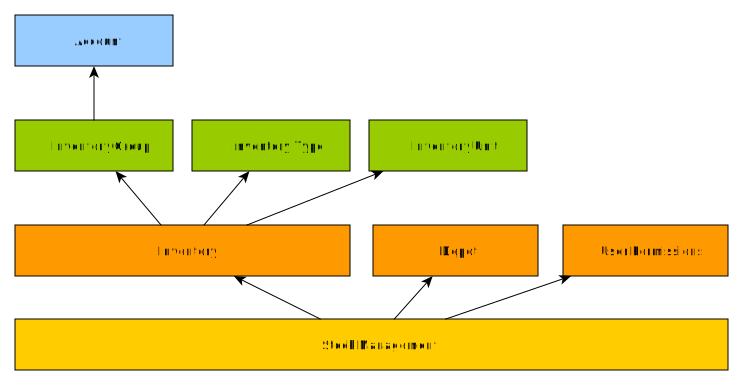

> [Accueil](../index.md) / [Gestion des stocks](./index.md) / Aperçu de la gestion des stocks

# Aperçu de la gestion des stocks

La gestion des stocks dans BHIMA permet de :

- Avoir la fiche de stock de chaque article (inventaire) en temps réel
- Valoriser les stocks en temps réel
- Savoir l'état des stocks en temps réel
- Faire les entrées de stocks :
    - Entrée des stocks en provenance des achats
    - Entrée des stocks en provenance des intégrations
    - Entrée des stocks en provenance des donations
    - Entrée des stocks en provenance d'un autre dépot
- Faire les sorties de stocks :
    - Sorties des stocks vers des patients
    - Sorties des stocks vers des services
    - Sorties des stocks vers d'autres dépôts
    - Sorties des stocks comme perte de stocks
- Faire les ajustements de stocks
- Faire les assignations de stocks
- Consulter les registres numériques des stocks :
    - Le registre des lots
    - Le registre des inventaires
    - Le registre des mouvements des stocks

### les dépendances de la gestion de stock

Pour faire la gestion de stock avec BHIMA il y a certaines dépendences qu'il faudrait avoir au préalable.

Cette gestion exige certains pré-requis :

- **La présence des dépôts** : les stocks se trouvent toujours dans des dépôts, d'où on ne peut faire la gestion des stocks sans définir des dépôts.

- **La présence des inventaires** : les inventaires dans BHIMA sont les informations sur des articles ou des services, mais dans le context du stock ce sont les informations sur des articles qui peuvent être stocké dans des dépôts

- **La présence des utilisateurs ayant les permissions requises sur les dépots** : BHIMA dispose d'une politique de permission sur les dépôts, c'est-à-dire que seul les utilisateurs autorisés peuvent avoir accès à un dépot donné

Pour la configuration automatique, seule les rubriques qui s’expriment en pourcentage, calculées automatiquement, ou bien ceux dont les valeurs sont définies par employés seront prises en compte. La configuration automatique ne concerne que les employés qui sont en attente de configuration.

