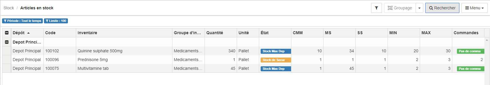

> [Accueil](../../index.md) / [Gestion des stocks](../index.md) / [les registres](./index.md) / Registre des inventaires

# Registre des inventaires

Pour acceder au registre des inventaires :

  

  Stock > <strong>Articles en stock</strong>
  

Ce registre liste tous les articles en stock dans différents dépots, on peut y trouver :
- L'intitulé de l'article
- La quantité en stock
- L'état du stock
- La consommation mensuelle moyenne
- Le nombre de mois de stock
- Le stock de sécurité
- Le stock minimum
- Le stock maximum
- La quantité à commander

### Filtre

Voir [les registres de stock](./index.md)

### Groupage

Voir [les registres de stock](./index.md)

### Recherche

Voir [les registres de stock](./index.md)

### Menu

Voir [les registres de stock](./index.md)
