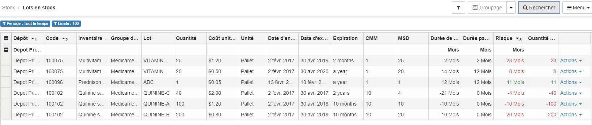

> [Accueil](../../index.md) / [Gestion des stocks](../index.md) / [les registres](./index.md) / Registre des lots

# Registre des lots

Pour acceder au registre des lots :

  

  Stock > <strong>Lots en stock</strong>
  

Ce registre liste tous les lots des article en stock dans différents dépots, on peut y trouver :
- L'intitulé de l'article
- L'intitulé de lot
- La quantité du lot en stock
- Le cout unitaire
- La date d'entrée en stock
- La date d'expiration
- Le CMM (Consommation mensuelle moyenne)
- Le MSD (Mois de stock disponible)
- La durée de vie du lot
- La durée de vie du lot par consommation
- Les risques
- Les quantités à risque

### Filtre

Voir [les registres de stock](./index.md)

### Groupage

Voir [les registres de stock](./index.md)

### Recherche

Voir [les registres de stock](./index.md)

### Menu

Voir [les registres de stock](./index.md)
