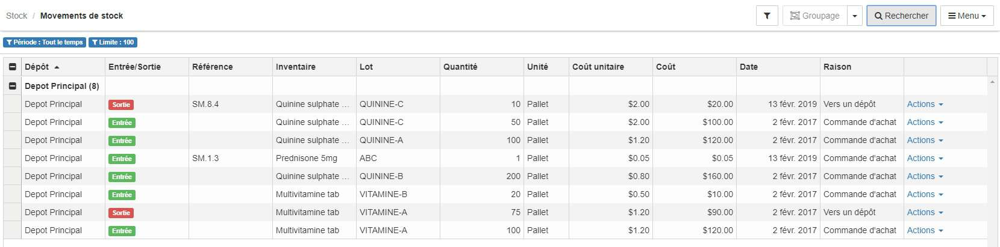

> [Accueil](../../index.md) / [Gestion des stocks](../index.md) / [les registres](./index.md) / Registre des mouvements

# Registre des mouvements

Pour acceder au registre des mouvements :

  

  Stock > <strong>Mouvements de stock</strong>
  

Ce registre liste tous les mouvements de stock qui ont eu lieu dans le système, on peut y trouver :
- Le Dépot
- Le type de flux (entrée ou sortie)
- La reférence du mouvement
- L'intitulé de l'inventaire
- L'intitulé du lot
- Le cout unitaire
- La date du mouvement
- La raison
- La génération du document du mouvement

### Filtre

Voir [les registres de stock](./index.md)

### Groupage

Voir [les registres de stock](./index.md)

### Recherche

Voir [les registres de stock](./index.md)

### Menu

Voir [les registres de stock](./index.md)
