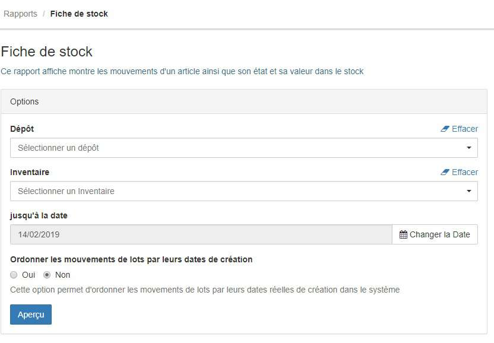
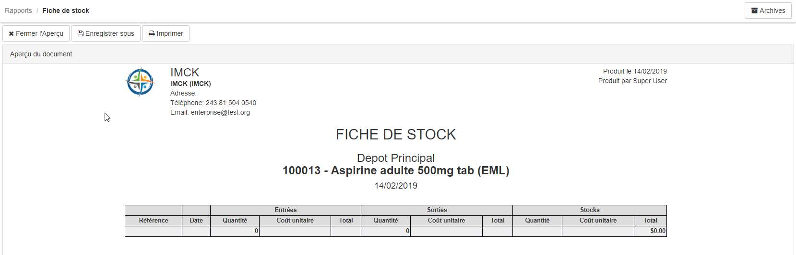

> [Accueil](../../index.md) / [Gestion des stocks](../index.md) / les rapports

# Les rapports

Les rapports de stock sont des documents que l'on peut générer automatiquement avec BHIMA juste en précisant certains paramètres. Parmis ces documents, nous avons :

- [La fiche de stock](./stock_sheet.md)
- [L'etat du stock](./stock_status.md)
- [La valeur de stock](./stock_value.md)
- [Les sorties de stock](./stock_exit.md)

Tous les rapports fonctionnent sur le principe qu'il faut :

1. Définir les options du rapport concerné : Ex. le cas ci-dessous est le rapport de la fiche de stock

Remplir les options avec des valeurs en fonction de ce que l'on souhaite avoir.

2. Générer le document en cliquant sur `Aperçu`

Cette nouvelle page d'aperçu permet :
- De sauvegarger le document en format PDF pour une consultation ulterieure
- D'imprimer le document
- De consulter les archives